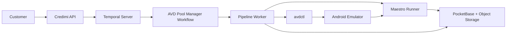
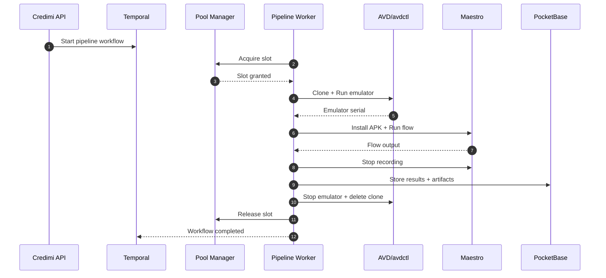
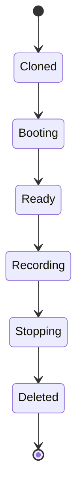

# Pipeline Execution Architecture

This document explains how Credimi executes mobile compliance pipelines, from API request to emulator cleanup.

## System Overview

## Pipeline Sequence

## State Machines

### AVD Lifecycle

### Pool Manager

- **Available**: Slots are free.
- **Queued**: Requests wait for a slot.
- **Active**: Leases are assigned to running workflows.
- **Expired**: Lease heartbeat expired → slot reclaimed.

### Recording

- **Starting** → **Recording** → **Stopping** → **Uploaded**
- On failure, a **DLQ entry** is recorded in `failed_cleanups` for reconciliation.

## Key Guarantees

- Cleanup runs in a saga with retries.
- Failed cleanup steps are recorded and reconciled.
- Search attributes capture status (`queued`, `booting`, `recording`, `cleanup`, `failed`, `completed`).
- Operators can query workflow state and pool status via CLI.
