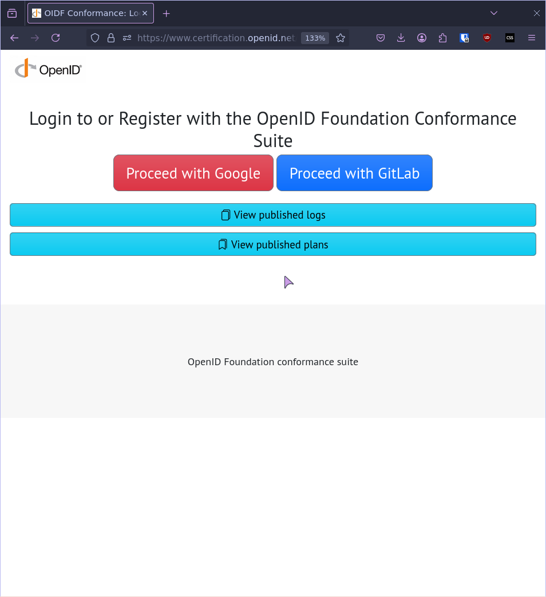
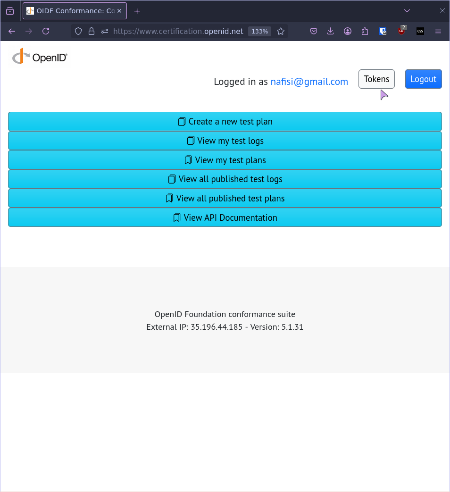
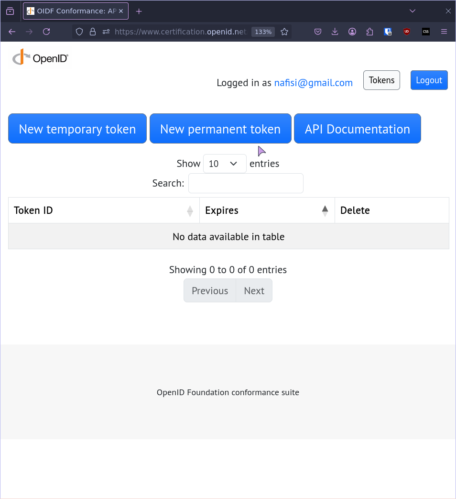
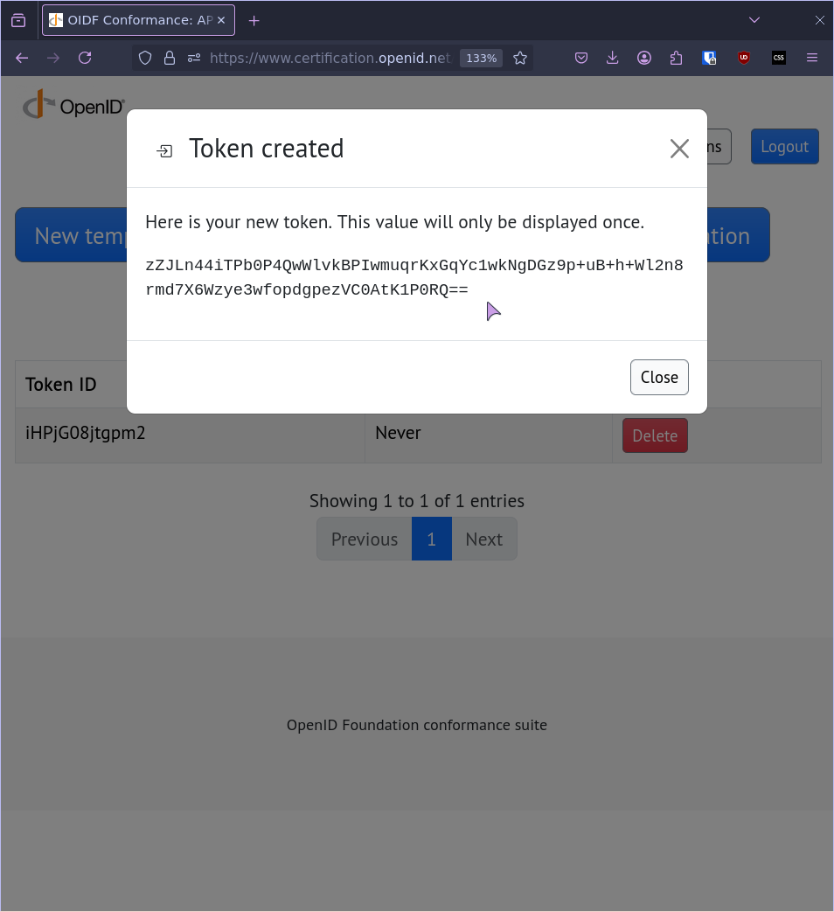

# Docker deployment

## Prerequisites
Obtain a TOKEN from the https://www.certification.openid.net

### 1. Login (Google/GitLab)



### 2. Click on **Tokens** on the navigation menu


### 3. Generate a **New permanent token**



### 4. Copy and save the token in a safe place



### 5. Git clone the credimi project
```bash
git clone https://github.com/forkbombeu/credimi
```
### 6. create a `.env` in the root of the `credimi` source code and put the following
```
OPENIDNET_TOKEN=<your new permanent token>
```

## Run the server
To run a local instance run the following:
```bash
make docker
```

Then the UI will be available on your http://localhost:8090
