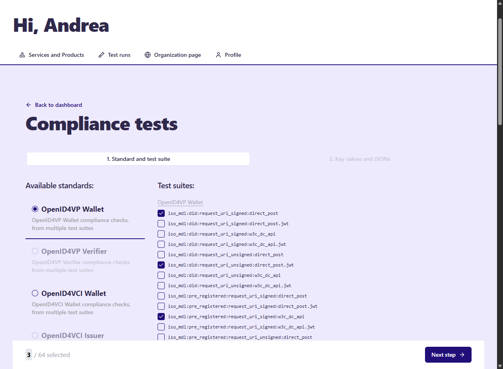
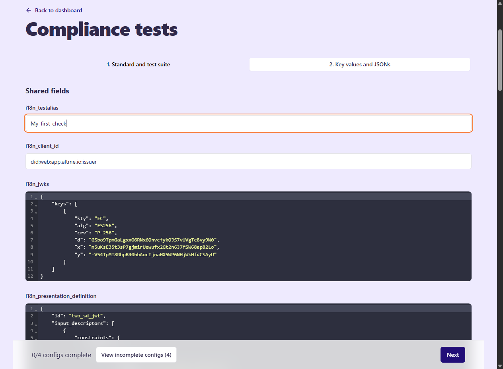
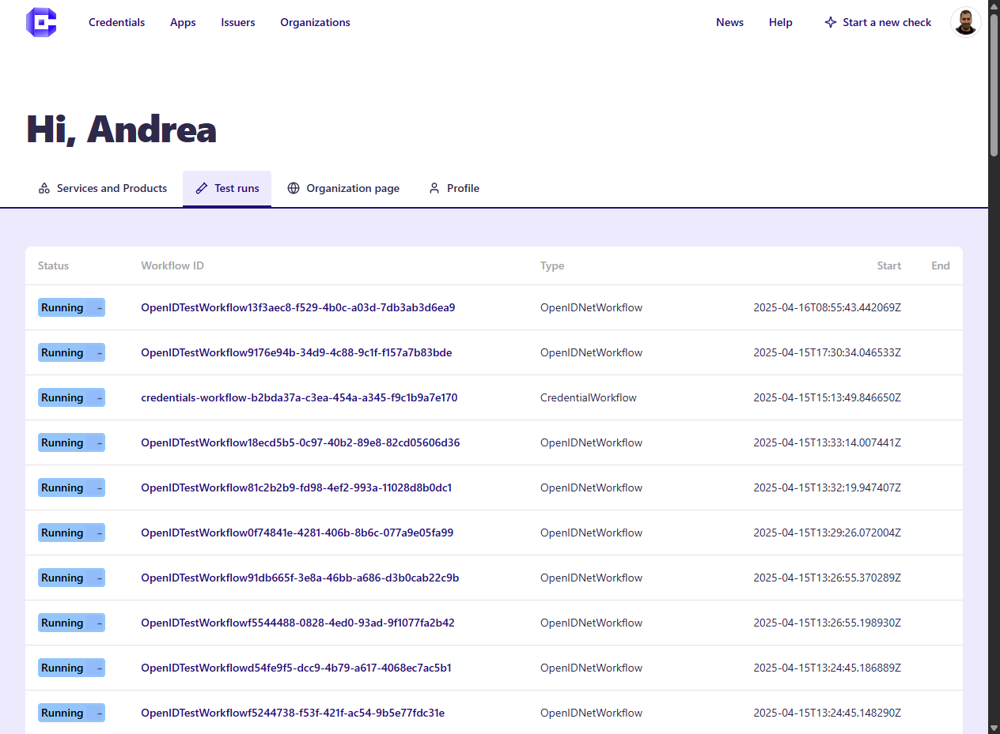
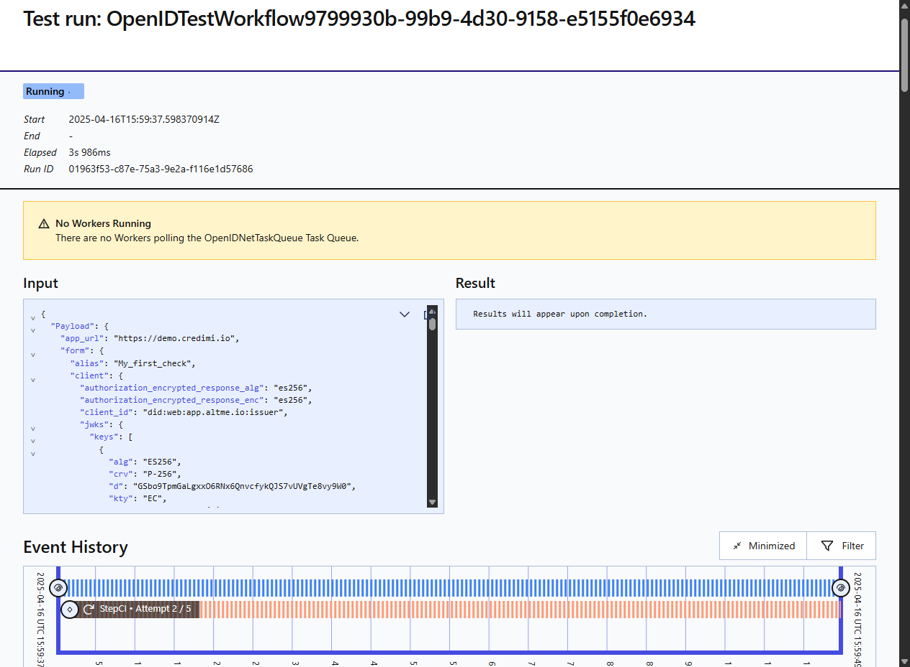

Credimi lets logged-in users run conformance checks against supported profiles and suites.

## Start a new check

Use the web GUI to select one or more tests and provide the required inputs.

After submission, Credimi creates one or more runs and tracks them in your account.

## Inspect the result

You can review the status of current and past runs from the dashboard.

Open a single run to inspect its details and outputs.

## Notes

- some flows complete entirely server-side
- some flows require manual interaction through a test page
- pipeline automation can later build on the same underlying assets

> Placeholder: later split this page by suite family if the number of suites grows substantially.
