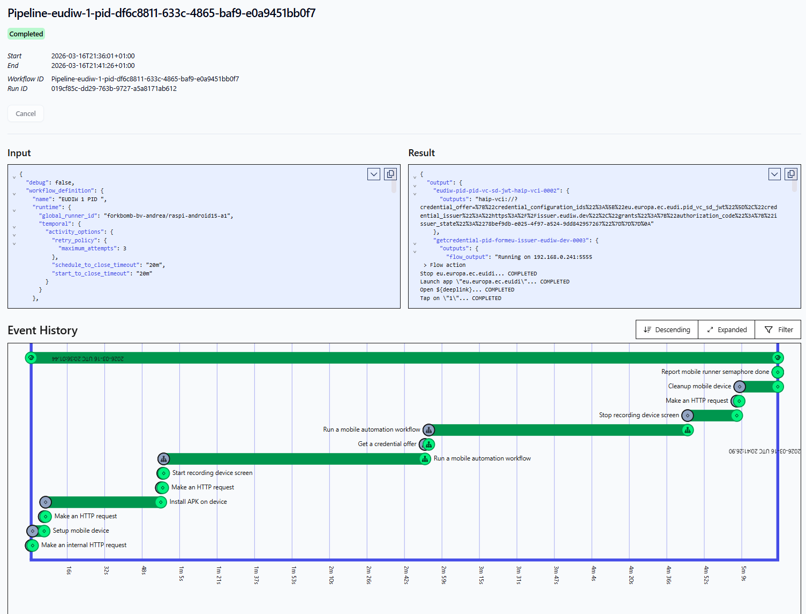


# Create your first pipeline

This guide walks through a complete automated flow:

- Setup a wallet  
- Generate a credential offer  
- Receive the credential  

Pipelines combine:

- **Maestro** → mobile automation  
- **StepCI** → service interaction  

---

## Step 1 — Integrate an Issuer, generate a credential offer (StepCI)

Add a **Credential Deeplink** step.

- Go to the **Issuers/Credentials** page https://credimi.io/my/credential-issuers-and-credentials 


- Click on **+ Add new credential issuer**
- If your Issuer supports static .well-known, you can import it here to auto-populate the issuer


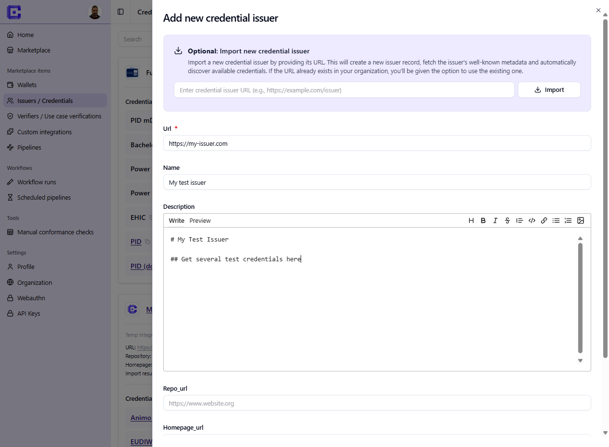

- Then click on **+ Add new credential**: here write a **StepCI script** to call an issuer and generate a credential offer.

👉 https://docs.stepci.com/

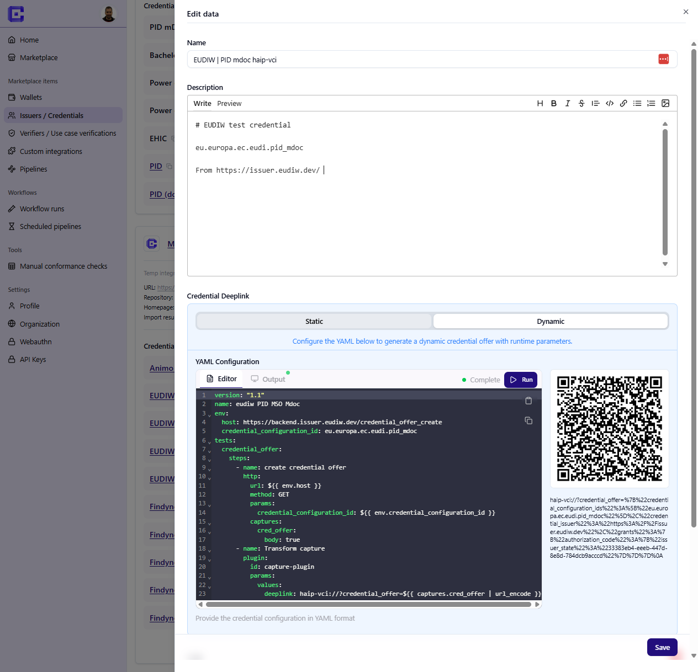

The output is a deeplink:

```text
haip-vci://...
````

Or:

```text
openid-credential-offer://
````

If you publish the integration, you can you can preview the StepCI output directly in the **Marketplace** https://credimi.io/marketplace?tab=credential-issuers-and-credentials :

* QR code
* clickable deeplink


---

## Step 2 — Add a Wallet 

- Go to the **Wallets** page https://credimi.io/my/wallets 

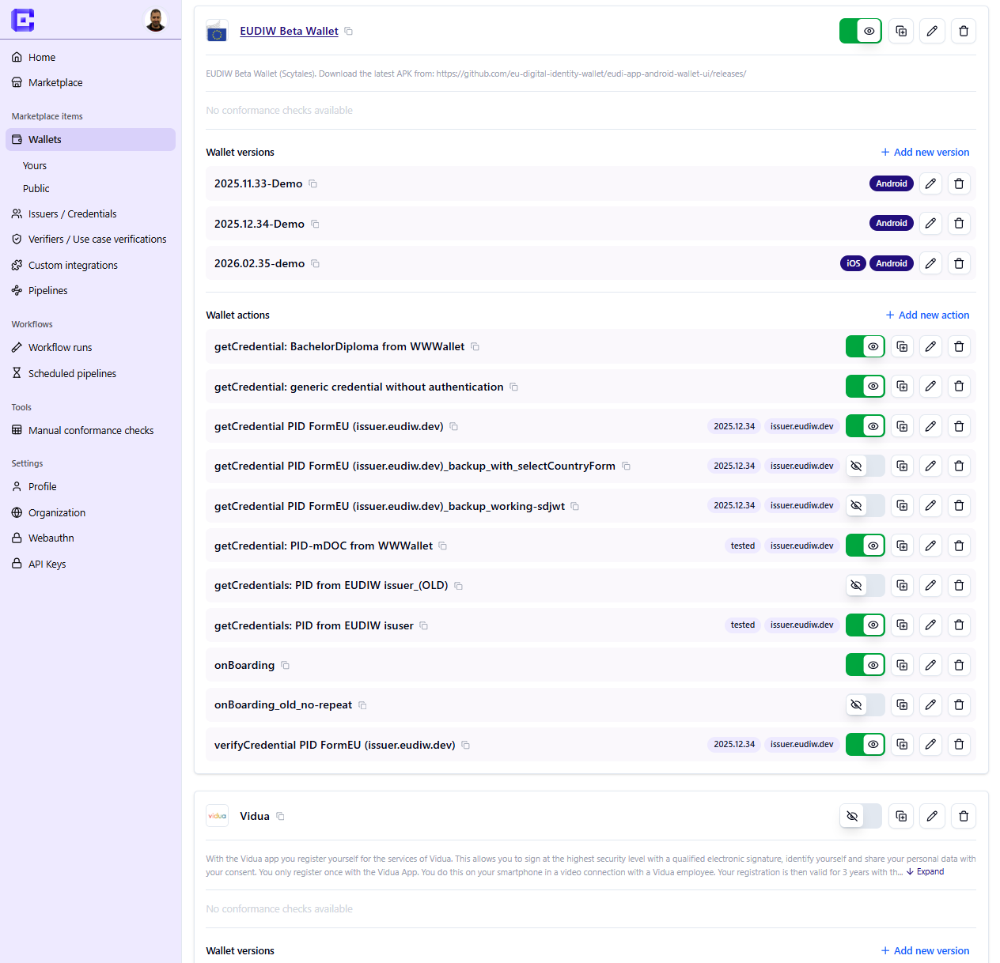

- Click on **+ Add new wallet** and add the metadata, this could be visible on the Marketplace if you publish the Wallet.
- If the Wallet is already on the Android/iOS stores, you can import the metadata from there

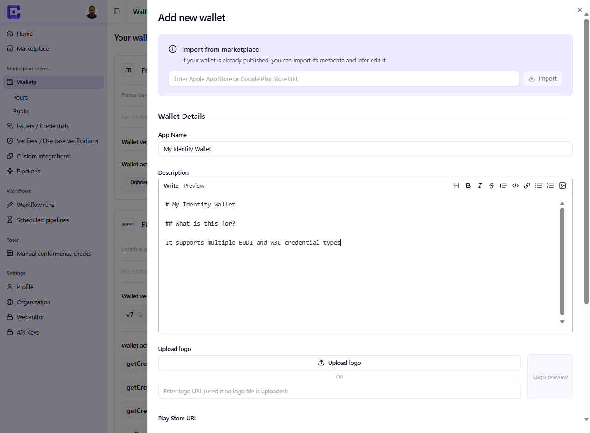

- **Important**: add a Wallet version and upload the .apk and iOS packges. This will enable the pipeline engine to automatically install the Wallet on the device/emulator/simulator for automated testing. The *Version* can optionally be made *downloadable* from the Marketplace (but this is not a requirement for the automated testing to work.

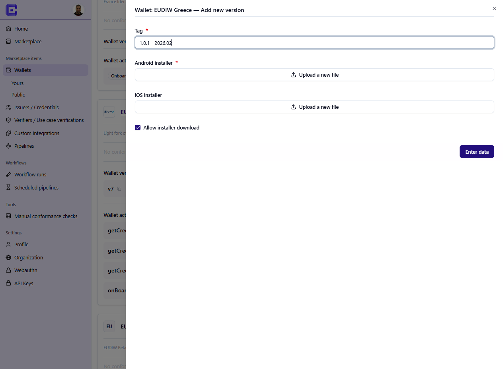

Add the **Wallet** automation steps using Maestro:

- open the wallet  

---


## Step 3 — Prepare the wallet (Maestro)

Add the **Wallet** automation steps using [Maestro](https://maestro.dev/):

- open the wallet  
- complete onboarding (PIN, permissions)  

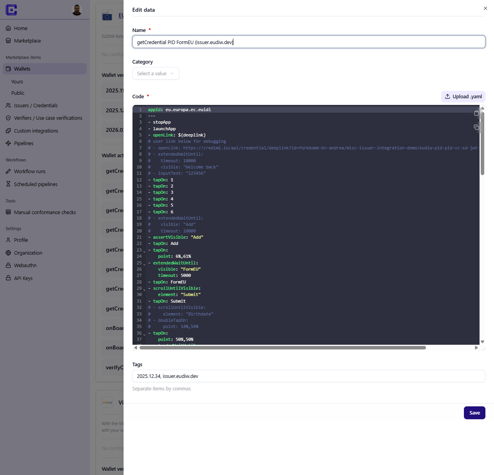

**What is Maestro?**: it's mobile testing automation framework, that we integrated into credimi.io

You probably want to use [Maestro Studio](https://maestro.dev/#maestro-studio) and look at [Maestro docs](https://docs.maestro.dev/reference/commands-available).


---

## Step 4 — Receive the credential (Maestro)

Add another **Wallet** step.

This consumes the deeplink:

```yaml
- stopApp
- launchApp
- openLink: ${deeplink}
```


This triggers the wallet to complete issuance.

---

## Step 5 — Create a pipeline

Go to the **Pipelines** page https://credimi.io/my/pipelines 

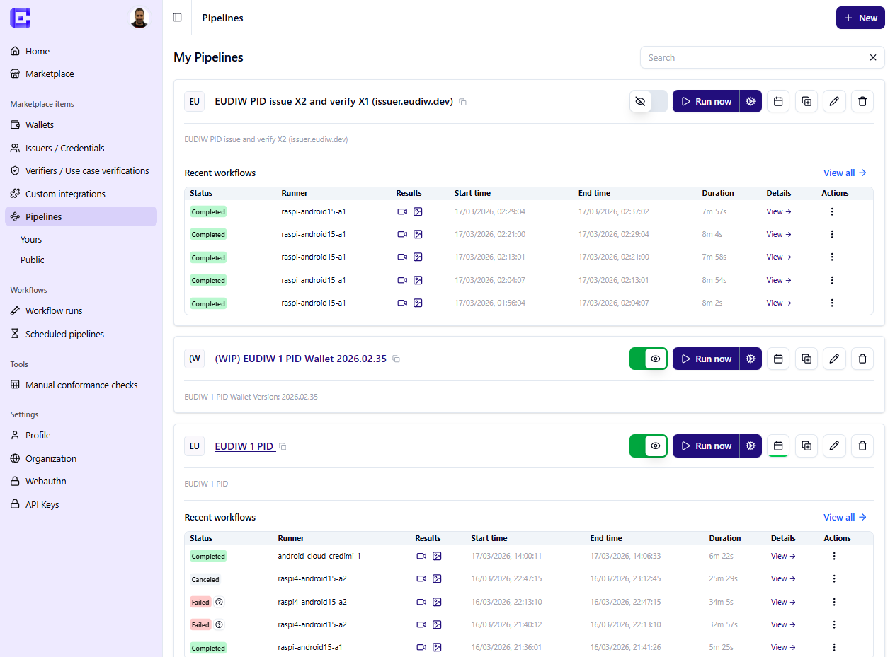

Click on **New** to ppen the pipeline editor and create a new pipeline.

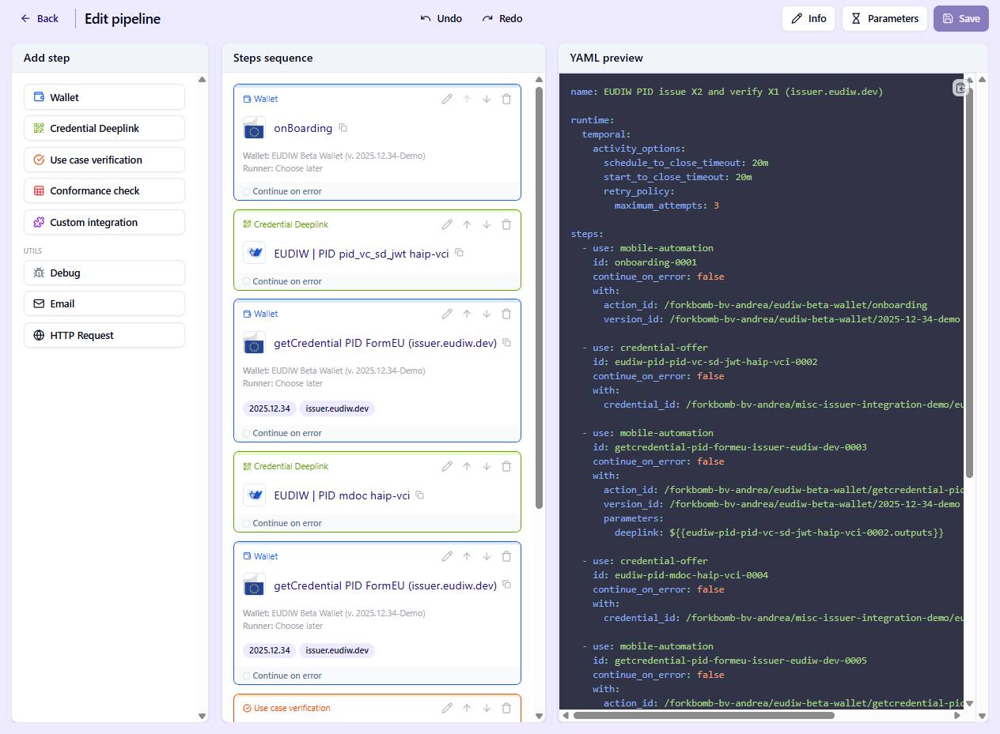

You define a sequence of steps executed automatically.


---

---

## Step 6 (Advanced) — Add a Verifier, integrate a use case verification flow

In the same fashion as you created an Issuer and integrated the Credential issuance flow using StepCI, you can integrate a Verifier. 

- Click on **Verifiers** to land on https://credimi.io/my/verifiers-and-use-case-verifications 
- Click on **+ Create verifier** 
- Add a StepCI script to integrate a use case verification flow
- Create a Maestro script to execute the verification on the Wallet

You can then add the use case verification in the Pipeline, similarly to how you did for the Credential Issuance.

---

---

## Step 7 (Advanced) — Add a Conformance Check

You can also add a Conformance Check in the Pipeline, this is also done in the pipeline editor: 

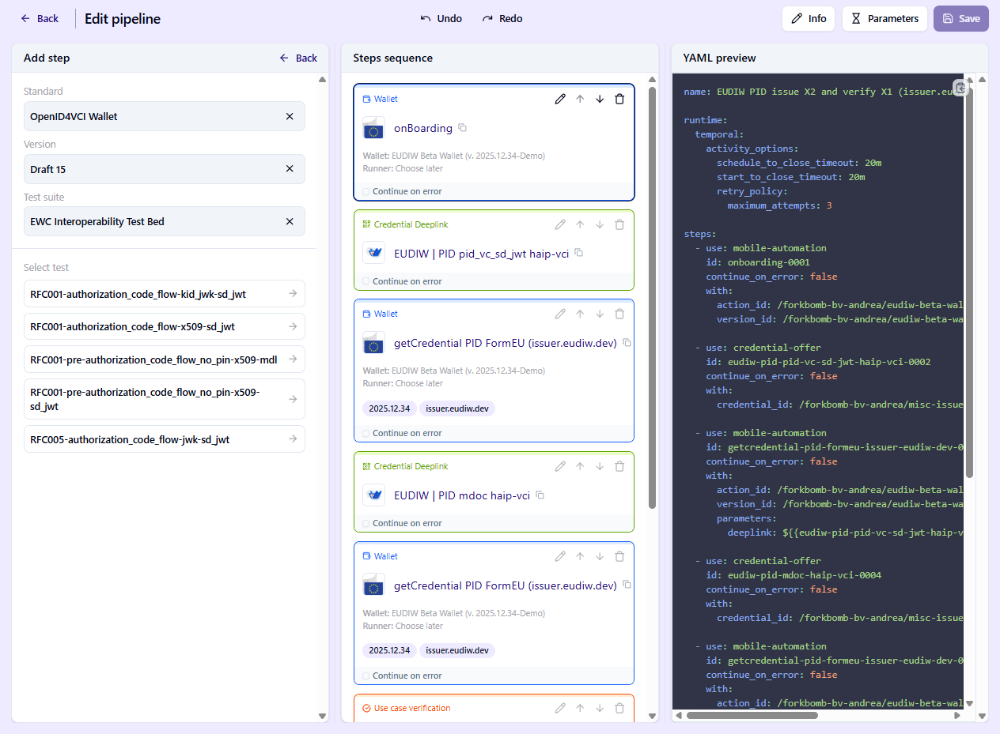

---


## Step 8 — Run the pipeline

Execute the pipeline from the pipelines list:


- Click on the **⚙️ gear** next to the **▶️ Run** button, to select the **runner** you want the mobile automation to be executed on:

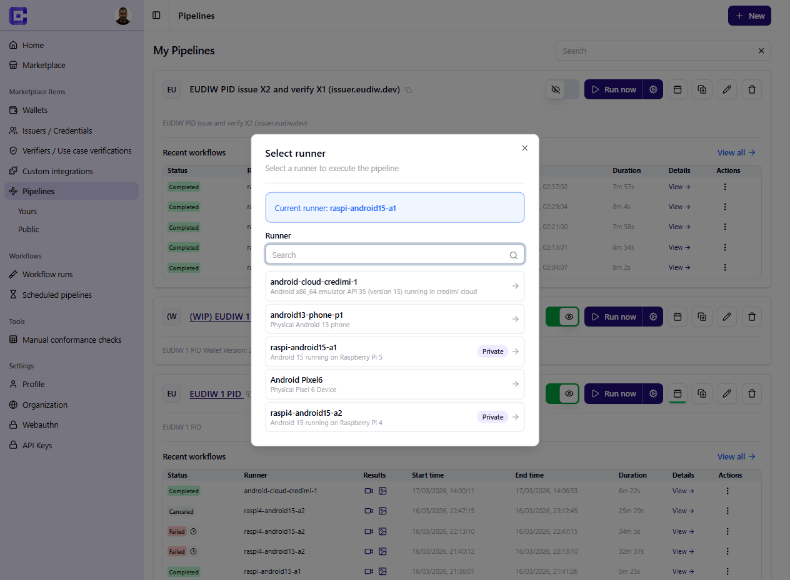


- Click on the **▶️ Run** button to launch the pipeline.


The system will:

* start a device
* execute steps sequentially
* pass outputs between steps

---

## Step 9 — Inspect execution

During or after the pipeline execution you can click on the **view->** link to see a detailed timeline of the execution:

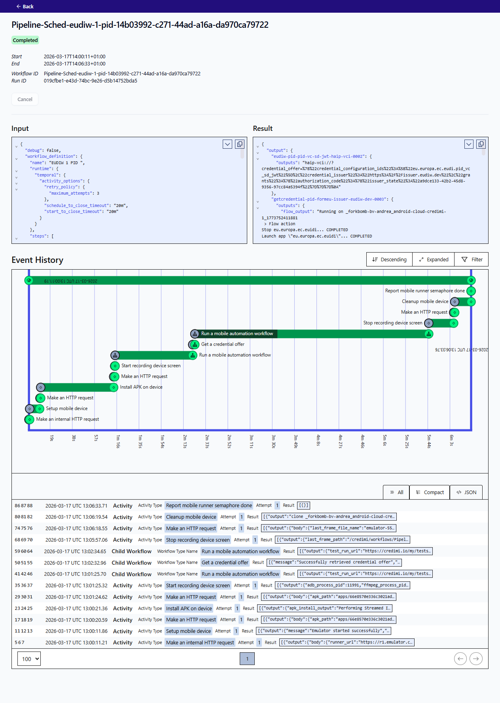

You can inspect:

* StepCI calls
* Maestro actions
* device lifecycle

After the pipeline completede execution you can also view the **video, screenshot and logs output** captured during the execution. 


---

## Summary

Pipelines allow you to:

* automate credential issuance and verification flows
* connect services (StepCI) and UI (Maestro)
* run reproducible end-to-end tests

You can extend pipelines by chaining multiple steps to test full identity scenarios.

```
