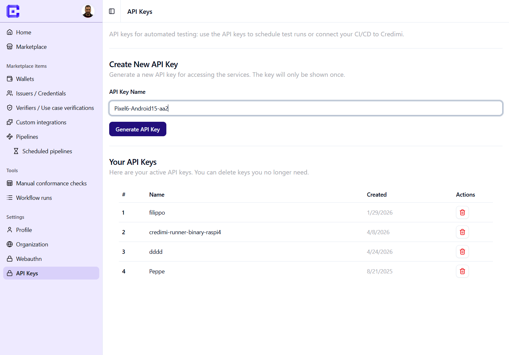

# Configure API Keys

API Keys are used to authenticate your runner with Credimi and to enable:

- pipeline execution
- scheduled runs
- CI/CD integrations

You can manage API keys from your profile:

**Settings → API Keys**

---

### Create a new API Key

1. Navigate to **API Keys**
2. Enter a name (e.g. your device or runner name)
3. Click **Generate API Key**

> [!TIP]
> Use a descriptive name (e.g. `raspi5-runner-1`, `pixel6-local`) to identify which runner is using the key.

---

### Important notes

- The API key is shown **only once** when created  
- Store it securely (you will need it in the runner setup)  
- If lost, you must generate a new one  

---

### Using the API Key

During the `credimi-runner` setup, you will be asked to provide:

- your API Key  
- your Credimi endpoint  

The runner will then:

- register itself in Credimi  
- authenticate all communications  
- receive pipeline execution requests  

---

### Managing API Keys

From the API Keys page you can:

- view existing keys  
- delete keys you no longer need  

> [!IMPORTANT]
> Deleting a key immediately disconnects any runner using it.

---

### Best practices

- Use **one API key per runner**
- Do not reuse keys across environments (dev / staging / prod)
- Rotate keys periodically if used in CI/CD