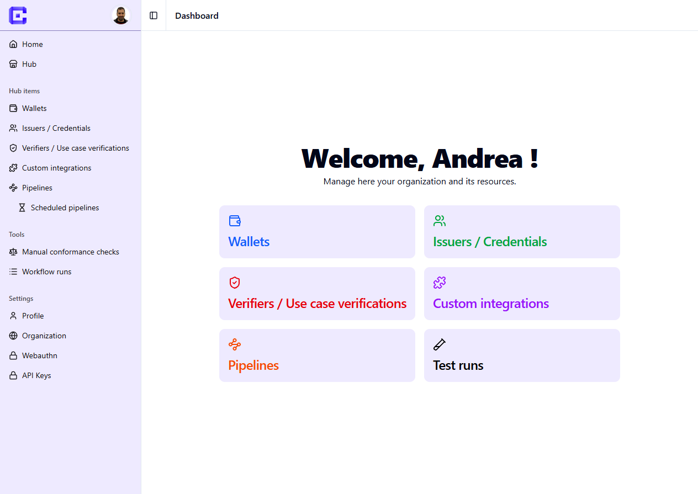
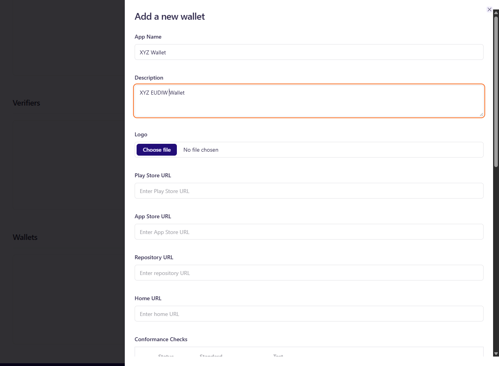
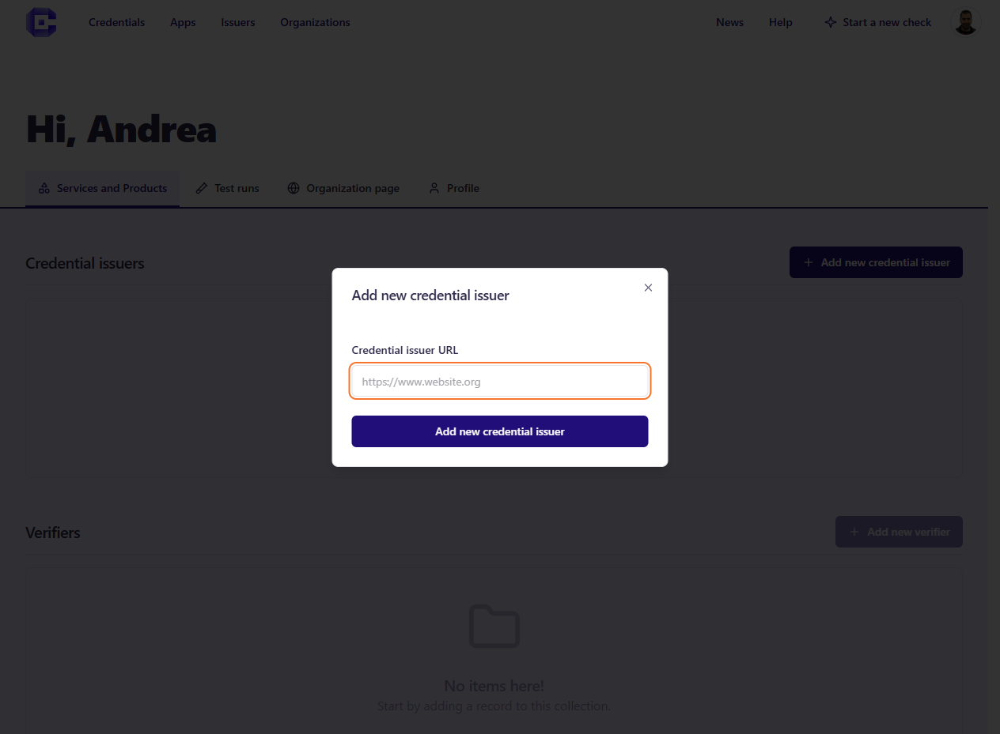

Any registered user can publish Products and Services (Wallets, Issuers, Verifiers) on the Hub. 

To publish a product or service, an organization must be configured first. After that, you can create or import products and services through different paths.

## Create an organization
When you sign up as a new user, an empty organization is also created. This organization can be edited in the Developer Dashboard. 

## Add a Product/Service
There are different paths to create products (typically mobile Wallets) and services (typically credential issuance and verification): 

#### Add a Wallet

- Products (Wallets): click on **Add Wallet** and fill in all fields. A product is created from scratch and can be edited later. It mainly contains metadata such as name, description, logo, and links. 

#### Add a Credential (...add a Credential Issuer first!)

- Credential issuance: to add a credential issuance service, first set up an Issuer. Start by clicking **Add a Credential Issuer**. After entering an Issuer URL, the credentials offered by that Issuer should be automatically created and populated. 

After that, each credential gets a deeplink with a corresponding auto-generated QR code. You can still modify it manually. This allows **visitors to test the credential issuance flow with their Wallets**.

#### Add a Verifier 
- Credential Verification: (coming soon)
