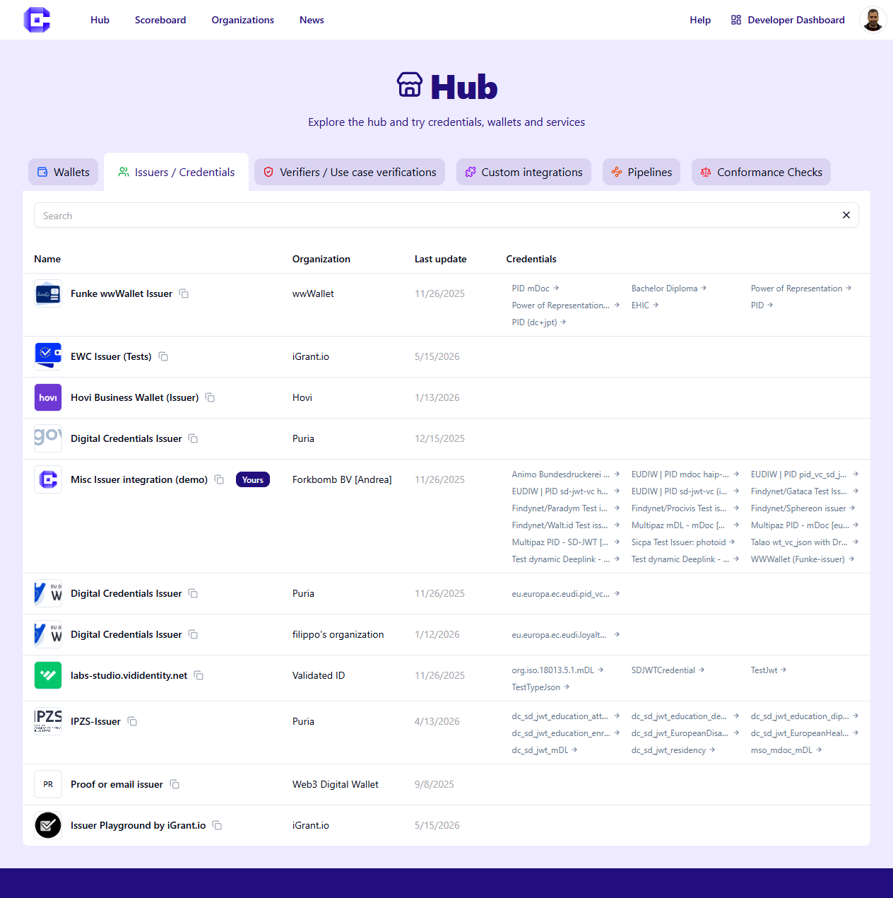
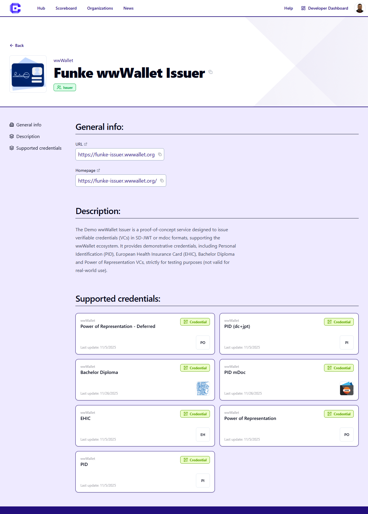

The Hub is the public entry point to Credimi. Users do **not** need an account to browse it.

The Hub is designed for two related goals:

- help visitors explore available Wallets, Issuers, Verifiers and credentials
- let visitors directly try issuance and verification services exposed by solution developers

Typical actions in this section:

- browse components and solutions
- open a credential or verification page
- scan a QR code or open a deeplink on a phone
- compare what different solutions expose

###

***Hub listing of Issuers and Credentials***
###

***Hub listing of one Issuer***

###

***Hub listing of one credential issuance flow: scan the QR with your Wallet to try it***

Continue with the next pages depending on whether you want to browse or directly try a flow.
