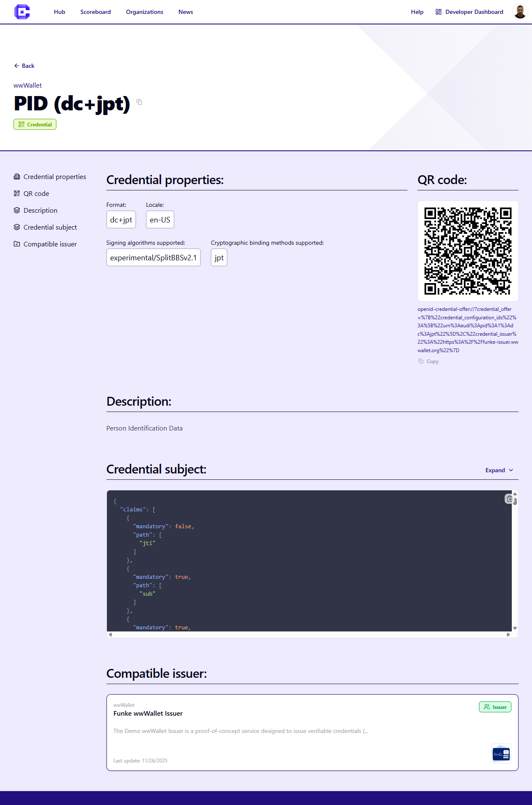
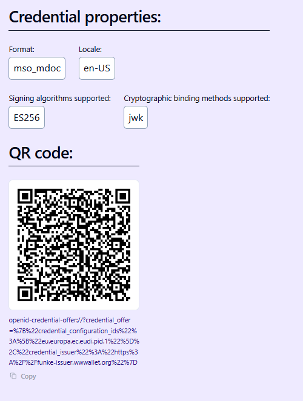

When a solution developer has added a StepCI integration, Credimi can expose a live issuance or verification flow directly on the Hub page.

Typical user flow:

1. open the credential page
2. scan the QR code with a Wallet, or open the deeplink on the phone
3. continue the issuance flow in the Wallet

## Try a credential issuance flow

Open a credential page and look for the generated QR code or deeplink.

#### Try from mobile

You can browse the Hub and open a Credential or Use Case Verification straight from your mobile phone. You can **click on the deeplink** or **click on QR code** to open your EUDI Wallet:

### Try a verification flow

Verification pages follow the same general pattern, but the output is a presentation request instead of a credential offer.

## What powers these flows

The QR code and deeplink shown on the Hub are generated by a StepCI recipe configured by the solution developer.

:::tip
Check how to integrate your [Issuer and Verifier using StepCI](../publish-to-hub/integrate-with-stepci.md)
:::
