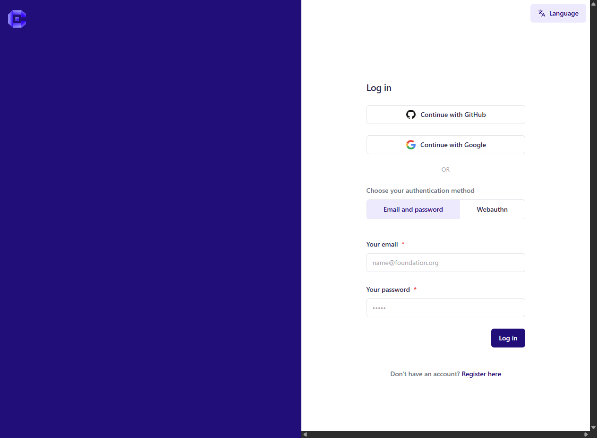
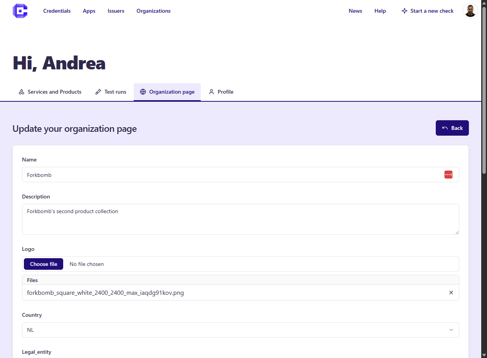

All publishing and authenticated testing features start from a user account.

## Create an account

Use the login entry point in the top-right corner of the site.

## Edit profile and organization

After sign-up, you can edit profile information and configure the organization associated with your published assets.

## Why the organization matters

The organization is the owner context for:

- Wallets
- Issuers
- Verifiers
- related marketplace assets and integrations
