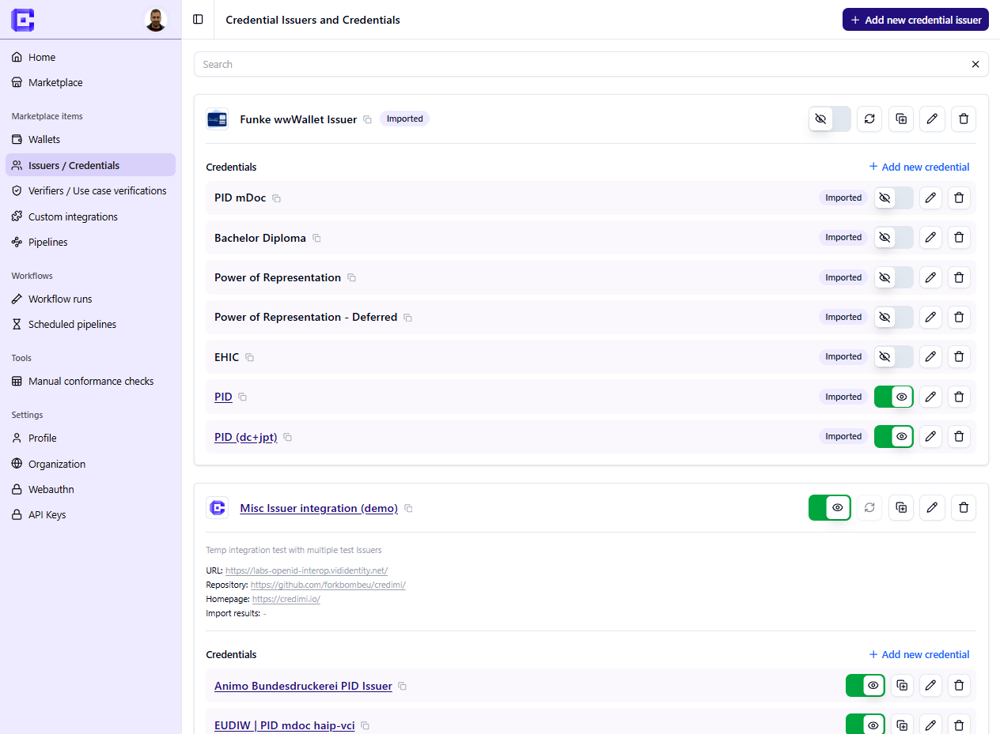

This section is for solution developers.

Publishing on Credimi has two distinct levels:

1. **List a solution** — add metadata, links and images for a Wallet, Issuer or Verifier.
2. **Integrate a live flow** — add StepCI per credential or verification so users can try the service directly on Credimi.

This distinction matters:

- metadata makes the solution discoverable on the Marketplace
- StepCI turns it into something visitors can actually try

Use the next pages to go from account creation to live integrations.
