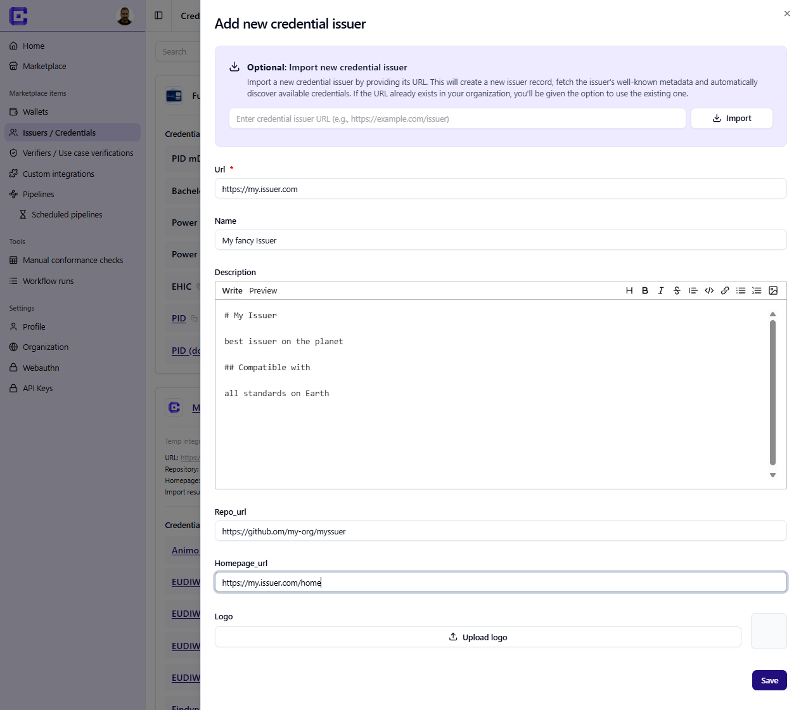

[StepCI](https://stepci.com) is the integration layer used by Credimi to interact with external Issuers and Verifiers.

In Credimi, StepCI is not used for generic API testing, but as a **runtime orchestration layer** that:

- performs one or more REST calls to Issuer or Verifier endpoints
- extracts relevant data from responses (JSON, HTML, images, etc.)
- applies transformations (e.g. regex, parsing, external helpers)
- produces a **deeplink** representing a specific issuance or verification flow

The deeplink is the key output used across the platform.

---

### Role in the Marketplace

In the Marketplace, StepCI is executed on demand to:

- trigger a specific use case on an Issuer or Verifier
- construct the corresponding deeplink
- generate a QR code from that deeplink

Users can then:

- scan the QR code with a Wallet  
- or open the deeplink directly on a mobile device  

This enables **manual testing of real issuance and verification flows**.

 

---

### Role in automation pipelines

In automation pipelines, the same StepCI configuration is reused as a step.

Instead of displaying a QR code:

- StepCI produces a deeplink  
- the deeplink is passed to the next step (typically a Maestro action)  

Example:

```yaml
appId: eu.europa.ec.euidi
---
- launchApp
    clearState: true
openLink: ${deeplink}
- tapOn: 1
- tapOn: 2
- tapOn: 3
- tapOn: 4
- tapOn: 5
- tapOn: 6
```

## Add a credential integration

- In the **Developer Dashbord**, go to [Credental Issuers and Credentials](https://credimi.io/my/credential-issuers-and-credentials)
- Click on **Add new credential issuer** and add the relevant metatdata
 





:::tip
If your isuser has a static .well-known (and the credential_offers have no session IDs), you can import the .well-known straight from this page. A list of Credentials will be auto-populated (you can later edit/delete each of them separately)
:::

--------

After you configured the Issuer, clik on **Add new credential**, here you can:
- Add some metadata for an individual credential issuance use-case
- Setup the integration, write and test the StepCI needed to retrieve the *deeplink* which will be used both in the **Marketplace** as well as in the **Automation Pipelines**. 
 


A successful recipe typically captures a deeplink such as:

```text
haip-vci://...
```

or:

```text
openid-credential-offer://...
```

## Add a verifier integration

Verification flows are integrated in the same way, but the output is usually a presentation request instead of a credential offer.

## Preview before publishing

Credimi lets you preview the generated QR code and deeplink before publishing the integration.


## Reuse later in automation

The exact same StepCI asset can later be used inside a pipeline, where the generated deeplink is passed to Maestro instead of being scanned manually.
