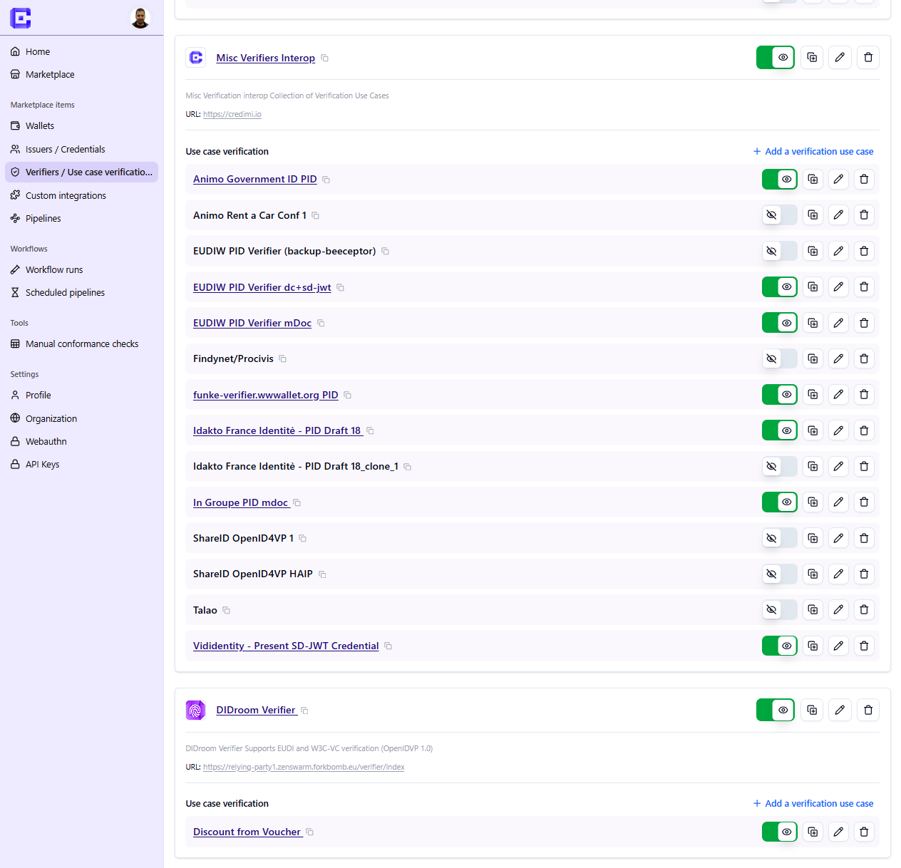

After the organization exists, you can create or import the components you want to list.

## Wallets

Wallet entries primarily start as metadata:

- name
- description
- images
- links
- versions

Wallet versions can later be reused for automation, especially when an APK or iOS package is attached.

## Issuers and credentials

Issuers expose one or more credentials.

## Verifiers and verification use cases

Verifiers follow the same pattern: metadata first, then live integrations later.

> Placeholder: later add a short explanation of imported vs hand-created entries.
