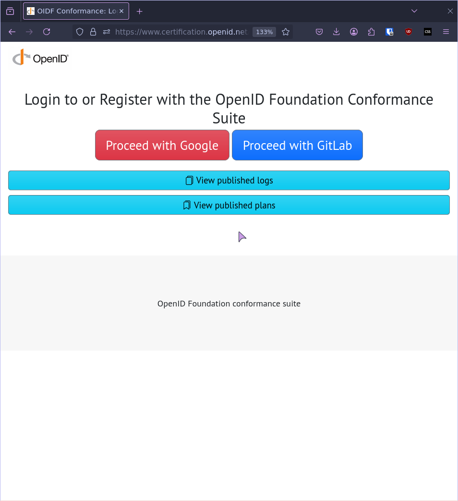
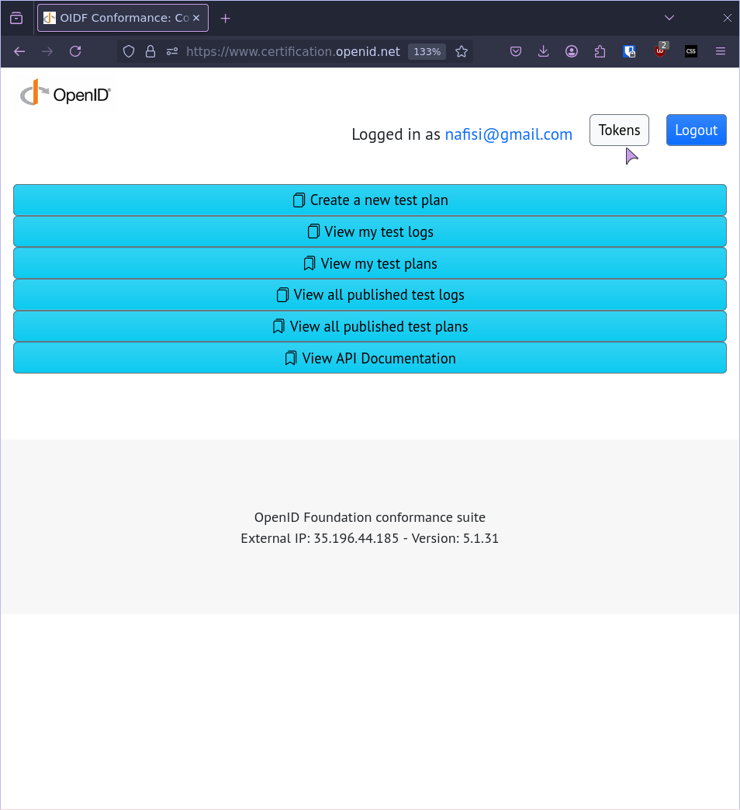
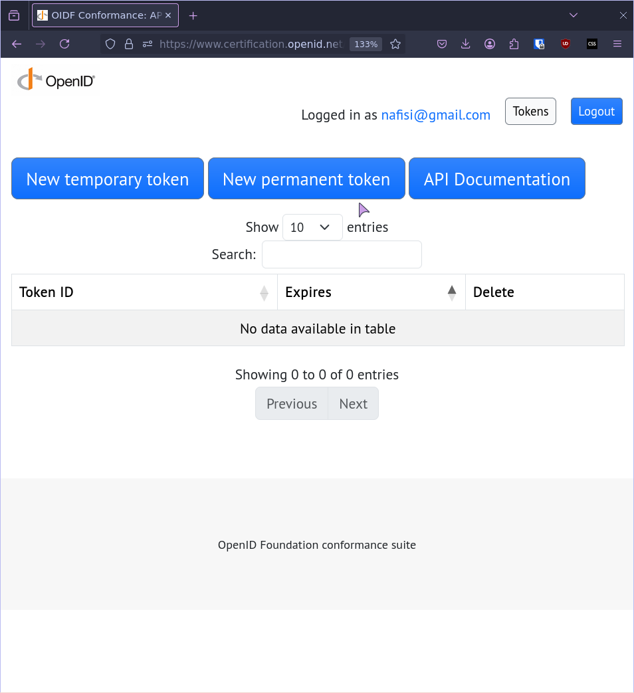
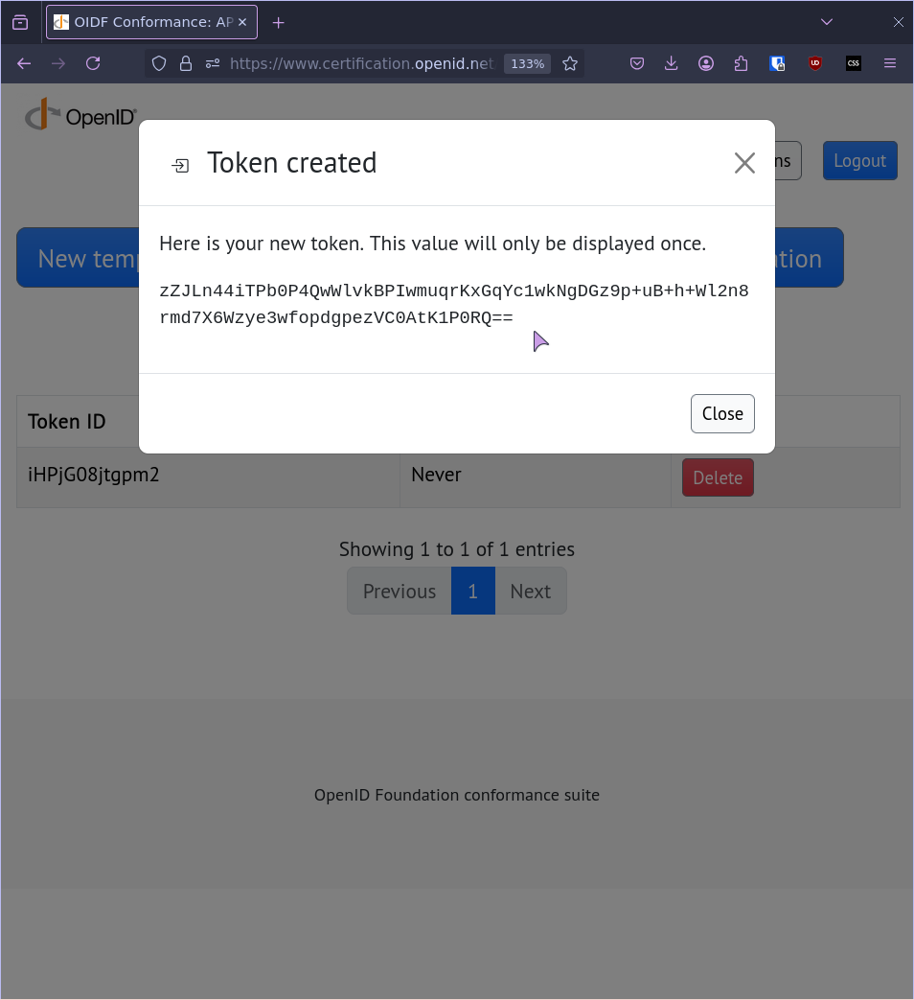

## Prerequisites
Obtain a TOKEN from the https://www.certification.openid.net

### 1. Login (Google/GitLab)



### 2. Click on **Tokens** on the navigation menu


### 3. Generate a **New permanent token**



### 4. Copy and save the token in a safe place



### 5. Git clone the credimi project
```bash
git clone https://github.com/forkbombeu/credimi
```
### 6. create a `.env` in the root of the `credimi` source code and put the following
```
OPENIDNET_TOKEN=<your new permanent token>
```

## Run the server
To run a local instance run the following:
```bash
make docker
```

Then the UI will be available on your http://localhost:8090

### Create the first superuser

A new deployment has no superuser and no default credentials. On first start, PocketBase logs a
one-time installer link, `http://localhost:8090/_/#/pbinstall/<token>`. Open it and create the
superuser with your own email and a strong password. You can also create it from the command line:

```bash
docker compose exec credimi credimi superuser upsert you@example.org '<strong password>'
```

`CREDIMI_SEED_SUPERUSER_PASSWORD` seeds `admin@example.org` for local development and test
fixtures only. Leave it unset in deployments: when it is unset, an upgrade removes an
`admin@example.org` superuser that still uses the old default password, or locks it with a random
password if it is the only superuser. Recover a locked account with `credimi superuser upsert`.
