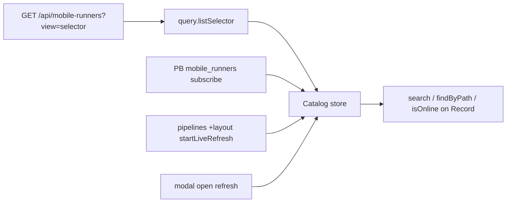

# Pipeline Runner Catalog — Design Spec

**Date:** 2026-05-20  
**Status:** Approved (design interview)  
**Scope:** Refactor webapp mobile-runner selection after `view=selector` API (#1193); rename list API fields; remove `StatusCoordinator`; unify under `Pipeline.Runner`.

**Supersedes (partially):** [2026-05-15-pipeline-run-now-button-design.md](./2026-05-15-pipeline-run-now-button-design.md) — offline/checking UX and status probing sections below replace the `Runners.status` model.

---

## Summary

The selector list endpoint already returns each runner’s **`is_online`** with identity fields. The webapp should treat that response as the **single source of truth**: one coalesced `Catalog.refresh()`, no per-runner health probes, no parallel online cache.

Public API is organized as **`Pipeline.Runner.Binding`** (persistence + YAML resolution) and **`Pipeline.Runner.Catalog`** (list, search, readiness, live refresh). Remove **`Pipeline.Runners`** from the barrel.

Backend list items rename JSON fields for accuracy (values are **canonified paths**, not DB ids). **Hard break** — no dual keys. Pipeline YAML keeps `runner_id` / `global_runner_id`.

---

## Problem

Post-#1193 webapp still mirrors the pre-selector architecture:

- `StatusCoordinator` probes “online” by re-fetching the same selector list (1s snapshot cache).
- `+layout.svelte` polls status every 30s while the store also refreshes on PB events.
- Components use `status.isOnline(path)` instead of `record.isOnline`.
- `wallet-action-step-form` refetches the full list on every debounced search.
- API field `runner_id` misnames a canonified path; `mine` is unclear.

---

## Decisions

| Topic | Decision |
|-------|----------|
| Search | **Sync** — `Pipeline.Runner.Catalog.search(text)` filters in-memory store |
| List freshness (records) | **Event-driven** — PB `mobile_runners` subscribe + org change; no poll for “search” |
| Online freshness | Same GET as list — `Catalog.refresh()` updates `is_online` on each record |
| Periodic refresh | **30s** on `/my/pipelines/**` via `Catalog.startLiveRefresh()` (immediate first tick) |
| Modal open | **`Catalog.refresh()`** once (coalesced) |
| Pre-run check | **None** — run pipeline; handle server errors later |
| Offline UI gating | **Keep** — disable Run / non-selectable cards when `isOnline === false` |
| Checking UI | **`!Catalog.isReady()`** — disable Run; i18n tooltip; gray dot in selector |
| Pre-run `refresh` | **No** |
| `StatusCoordinator` | **Delete** entirely |
| `refresh()` concurrency | **Coalesce** — one in-flight promise shared |
| Refresh failure (after ready) | **Keep last snapshot**, log error |
| Refresh failure (first load) | **`isReady()` false**, empty/checking UX |
| Public API shape | **`Pipeline.Runner.Binding` + `Pipeline.Runner.Catalog`** |
| Type name | **`Pipeline.Runner.Record`** (camelCase fields in TS) |
| Binding path helper | **`getExecutionRunnerPath`** (not `Id`) |
| API list field rename | **Hard break** — see wire format below |
| Pipeline YAML keys | **Unchanged** (`runner_id`, `global_runner_id`) |
| Wallet deserialize | **`listSelector()`** from `query.ts`, find by `path`; fallback stub if missing |
| Wallet / selector lists | **`$derived` / `Catalog.search`** — no `foundRunners` refetch |
| Types import | **Barrel only** — `$lib/pipeline/runner` / `Pipeline.Runner.Record` |
| Shipping | **One PR** — Go + OpenAPI + webapp |
| Tests | **Moderate** — Go handler tests + webapp readiness/zod/search |
| Checking copy | **New i18n key** (e.g. `Runner_status_checking`) for Run tooltip + selector |

---

## Architecture

### File layout

```
webapp/src/lib/pipeline/
  runner/
    index.ts              # Public Pipeline.Runner barrel
    binding.ts            # Binding.* (re-export or namespace)
    run-now-button.svelte
    runner-select-input.svelte
    runner-select-modal.svelte
    binding.test.ts
  runners/
    query.ts              # listSelector(), zod, wire → Record mapping (internal)
    store.svelte.ts         # state, refresh coalescing, isReady, live refresh
    catalog.ts              # optional: thin Catalog.* wrappers if not on index
```

**Delete:** `runners/utils.ts`, `status-coordinator.ts`, `status.svelte.ts`, `status.test.ts`

**Remove from `pipeline/index.ts`:** `export * as Runners`

### Public API (`Pipeline.Runner`)

```ts
// Type (barrel export)
export type Record = {
  name: string;
  path: string;           // canonified path, e.g. org/runner-name
  description?: string;
  isOwned: boolean;
  isPublished: boolean;
  isOnline: boolean;
  // full list view only:
  url?: string;
  type?: string;
  devices?: Device[];
  queueLength?: number;
};

// Catalog
Catalog.refresh(): Promise<void>       // coalesced
Catalog.search(text: string): Record[]
Catalog.findByPath(path: string): Record | undefined
Catalog.isReady(): boolean
Catalog.startLiveRefresh(ms?: number): () => void  // default 30_000; immediate refresh + interval
Catalog.init(): void
Catalog.dispose(): void

// Binding (existing helpers, namespaced)
Binding.set(pipeline, record: Record): void   // stores record.path
Binding.get(pipelineId: string): string | undefined
Binding.getType(pipeline): 'global' | 'specific' | 'not-needed'
Binding.isRequired(pipeline): boolean
Binding.getExecutionRunnerPath(pipeline): string | undefined

// Components
RunNowButton, SelectModal, SelectInput
```

### Internal query

```ts
// runners/query.ts — not exported from barrel
listSelector(): Task.Task<Record[], ClientResponseError | ZodError>
```

Zod parses API snake_case and maps to `Record` camelCase.

---

## API wire format (breaking change)

`GET /api/mobile-runners` and `?view=selector` — each element of `runners[]`:

| Old JSON | New JSON | Notes |
|----------|----------|--------|
| `runner_id` | `path` | Canonified path from `canonify.BuildPath` |
| `runner_url` | `url` | Full view only |
| `mine` | `is_owned` | |
| `published` | `is_published` | |
| `online` | `is_online` | |
| `queue_len` | `queue_length` | Full view only |
| `name`, `description`, `type`, `devices` | unchanged | |

**Selector view** omits: `url`, `type`, `devices`, `queue_length`.

**Not in scope:** `GET /api/mobile-runner?runner_identifier=`, queue `runner_ids`, pipeline YAML — keep existing names.

### Go changes

- `MobileRunnerListItem` struct json tags
- `mobile_runners_handlers_test.go` selector + list assertions
- `docs/public/API/openapi.yml` — `HandlersMobileRunnerListItem`

---

## Data flow



No side channel for online status.

---

## Freshness rules

| Trigger | Action |
|---------|--------|
| `hooks.client.ts` `Catalog.init()` | Subscribe PB + initial `refresh` when org set |
| Org change | New generation, `refresh` |
| `my/pipelines/+layout.svelte` | `onMount(() => Catalog.startLiveRefresh())` |
| Runner modal `open === true` | `Catalog.refresh()` |
| User typing in search | **No network** — `Catalog.search(text)` only |
| Run now click | **No extra refresh** |

### `isReady()`

- `false` until first **successful** `refresh()` for current org generation.
- After success: `true` until `dispose` / org cleared.
- Failed refresh **after** ready: keep prior `runners[]`, stay ready.
- Failed refresh **before** ready: stay not ready.

### UI states (Run now, runner required)

| Condition | Run button | Tooltip |
|-----------|------------|---------|
| `!isReady()` | Disabled | i18n checking |
| `isReady() && findByPath(path)?.isOnline === false` | Disabled | `Runner_offline_run_disabled` |
| `isReady() && (no path or online)` | Enabled | — |

Selector cards: disable select when `isOnline === false`; gray dot when `!isReady()` for list (optional: all dots checking until ready).

**Revert from 2026-05-15 spec:** Run is **disabled** while checking (`!isReady()`), not enabled during `undefined` status.

---

## Component notes

### `runner-select-input.svelte`

```ts
const foundRunners = $derived(Pipeline.Runner.Catalog.search(runnerSearch.text));
// Read store in derived deps: Catalog — ensure search re-runs when store updates
```

Use `item.isOnline`, `item.path`, `item.isOwned`, `item.isPublished`. Remove `status` import and probe `$effect`s.

### `runner-select-modal.svelte`

- `Catalog.refresh()` when `open`
- `currentRunner = Catalog.findByPath(currentRunnerPath)`
- `Binding.set(pipeline, runner)` uses `runner.path`

### `run-now-button.svelte`

```ts
const record = $derived(
  executionPath ? Pipeline.Runner.Catalog.findByPath(executionPath) : undefined
);
const isChecking = $derived(
  Runner.isRequired(pipeline) && executionPath && !Pipeline.Runner.Catalog.isReady()
);
const isRunnerOffline = $derived(
  Runner.isRequired(pipeline) &&
  Pipeline.Runner.Catalog.isReady() &&
  executionPath !== undefined &&
  Pipeline.Runner.Catalog.findByPath(executionPath)?.isOnline === false
);
```

Remove status probe `$effect`.

### `wallet-action-step-form`

- Remove `foundRunners` `$state` + async `searchRunner` fetch
- `$derived(Pipeline.Runner.Catalog.search(...))` or equivalent in `.svelte`
- Serialize step: `with.runner_id = runner.path` (YAML key unchanged)

### `wallet-action/index.ts` deserialize

```ts
const runners = await listSelector()...;
runner = runners.find(r => r.path === data.runner_id) ?? fallbackStub(path);
```

Fallback stub: `isOnline: false`, `isOwned: false`, `isPublished: false`, name from last path segment.

### `schedule-pipeline-form.svelte`

- `global_runner_id: runner.path`
- Import `Record` from barrel

### `hooks.client.ts`

```ts
Pipeline.Runner.Catalog.init();
// dispose on pagehide
```

### `my/pipelines/+layout.svelte`

```ts
onMount(() => Pipeline.Runner.Catalog.startLiveRefresh());
```

Remove `Runners.status.startPolling` / `stopPolling`.

---

## i18n

Add to `webapp/messages/en.json` (and other locale files as per project process):

- `Runner_status_checking` — e.g. “Checking runner status…”

Use for Run now tooltip when `isChecking`. Replace hardcoded `"Checking status"` on selector dot `title` with `m.Runner_status_checking()` or a shorter variant.

---

## Testing

### Go

- Update `TestListMobileRunners` / selector subtest for new json keys
- Assert omitted keys in selector view (`url`, `queue_length`, etc.)

### Webapp (Vitest)

- `binding.test.ts` — `Record.path`, `getExecutionRunnerPath`
- New `catalog.test.ts` or `store.test.ts`:
  - `search()` filters name + path
  - `isReady()` false until first success; true after; stays true on failed second refresh
  - zod parse fixture with new snake_case API body
- Delete `status.test.ts`

---

## Out of scope

- Renaming pipeline YAML `runner_id` / `global_runner_id`
- Renaming queue / internal `runner_identifier` query params
- Pre-run `refresh()` or fail-closed run blocking on API errors
- `Catalog.lastError()` / toast on background refresh failure
- Dual-key API deprecation period

---

## Implementation checklist

- [ ] Go: `MobileRunnerListItem` + handler + tests + OpenAPI
- [ ] Webapp: `query.ts`, `store.svelte.ts`, `runner/index.ts` barrel
- [ ] Delete status subsystem + `utils.ts`
- [ ] Wire Catalog/Binding across components listed above
- [ ] i18n `Runner_status_checking`
- [ ] Remove `Pipeline.Runners` export; fix all imports
- [ ] Vitest + `go test` handler package
- [ ] Optional: short note in root `AGENTS.md` under mobile runners (list field names)

---

## Open questions (none)

All branches resolved in design interview 2026-05-20.
