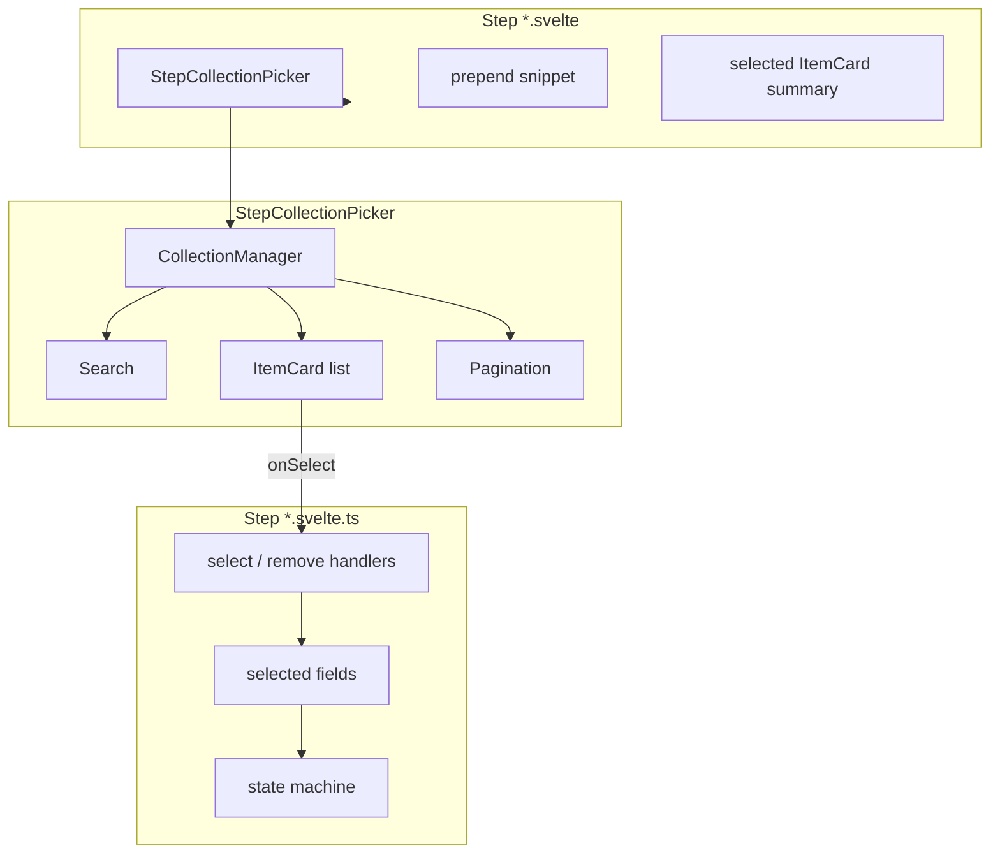

# Pipeline Step Collection Picker — Design Spec

**Date:** 2026-05-27  
**Status:** Approved (design interview)  
**Scope:** Refactor PocketBase-backed list sub-steps in pipeline funnel forms (`webapp/src/lib/pipeline-form/steps/`) to use a shared `StepCollectionPicker` wrapper around `CollectionManager`, with pagination and search built in. Step `*.svelte.ts` classes retain selection and funnel state only.

---

## Summary

Pipeline step funnels currently hand-roll search and list rendering (`Search` class, `search-hub.ts`, `getFullList` / capped `getList`). This limits results (e.g. 10 hub items) and duplicates logic that `CollectionManager` already provides on dashboard pages.

Introduce **`StepCollectionPicker`**: a thin wrapper that configures `CollectionManager` for single-select funnel use (no CRUD, no checkboxes), renders `ItemCard` rows, and exposes `prepend` for non-PB options. Step classes drop fetch/search code; views wire pickers per sub-step.

**Out of scope (v1):** conformance check (standards API), runner catalog, loading skeletons, extracting `CollectionQuery` from `CollectionManager`.

---

## Problem

| Step form | PB list sub-steps | Current data loading |
|-----------|-------------------|----------------------|
| `HubItemStepForm` | pick hub item | `searchHub()` — `getList(1, 10)` on `path ~ text` |
| `WalletActionStepForm` | wallet | `searchHub()` |
| `WalletActionStepForm` | version | `getFullList` on wallet filter in `selectWallet` |
| `WalletActionStepForm` | action | `getFullList` with inline name filter |
| `WalletActionStepForm` | runner | custom catalog (unchanged) |
| `ConformanceCheckStepForm` | standard → test | in-memory standards API (unchanged) |

Each sub-step duplicates search debouncing, empty states, and list rendering via `_partials/search-input.svelte`, `with-empty-state.svelte`, and step-specific fetch methods in `*.svelte.ts`.

---

## Decisions

| Topic | Decision |
|-------|----------|
| Scope | **PB-backed sub-steps only** — hub items, wallet versions, wallet actions |
| Selection | **Single-click picker** — click row/card to select and advance; no checkboxes, no bulk actions, no create/edit/delete in funnel |
| Visual | **Keep `ItemCard`** — funnel stays visually consistent; picker supplies data/search/pagination only |
| Structure | **`StepCollectionPicker` wrapper** in `steps/_partials/` around existing `CollectionManager` |
| Extra non-PB options | **`prepend` snippet** above search/list (e.g. external version) |
| Approach | **Approach 1** — wrap `CollectionManager`; do not extract `CollectionQuery` (v1) |
| Hub search fields | **`name`** (replacing path-only search); optionally add `path` later |
| Default page size | **`perPage: 10`** |
| Subscriptions | **On** — same as dashboard `CollectionManager` |

---

## Architecture



### New component

**File:** `webapp/src/lib/pipeline-form/steps/_partials/step-collection-picker.svelte`

Wraps `CollectionManager` with funnel defaults:

| Concern | Picker default |
|---------|----------------|
| CRUD | hidden — no create/edit/delete, no checkbox selection |
| Layout | `prepend` → `Search` (optionally in `WithLabel`) → scrollable list → `Pagination` |
| Empty/error | inherit `CollectionManager` states; optional `emptyText` override |

### Props

```ts
type StepCollectionPickerProps<C extends CollectionName> = {
  collection: C;
  queryOptions: PocketbaseQueryOptions<C>;
  queryAgentOptions?: PocketbaseQueryAgentOptions;
  onSelect: (record: CollectionResponses[C]) => void;
  label?: string;
  class?: string;
  emptyText?: string;
};
```

### Snippets

```ts
prepend?: Snippet;
item?: Snippet<[{ record: CollectionResponses[C]; onSelect: (record: CollectionResponses[C]) => void }]>;
```

Default `item` renders `ItemCard` and calls `onSelect(record)` on click. Steps with custom rendering (wallet action tags, version platform icons) override `item` and wire `onSelect` themselves.

### Outside the picker

- **Selected summary** — bordered block with discard buttons stays in each step `.svelte`.
- **Non-PB sub-steps** — runner catalog, conformance check tree unchanged.
- **Non-PB prepend items** — e.g. `EXTERNAL_VERSION` via `prepend`, not merged into PB query.

---

## Step class slim-down

### Removed from step classes

| Removed | Was in |
|---------|--------|
| `Search` instances | `WalletActionStepForm`, `HubItemStepForm` (except `runnerSearch` until runner migrates) |
| `found*` arrays | same |
| `search*` async methods | same |
| `search-hub.ts` usage | hub-item + wallet wallet-step |

### Kept in step classes

| Keeps | Role |
|-------|------|
| `data` / `selectedItem` state | current funnel selections |
| `state` derived (state machine) | active sub-step |
| `select*` / `remove*` / `discard*` handlers | update state, advance/rewind funnel |
| `canSave()` / `getSubmitData()` / `commit()` | unchanged `BaseForm` contract |
| Side effects on select | e.g. auto-set `runner = 'global'`; `ExecutionTarget` updates |

### Example — `HubItemStepForm` after

```ts
selectedItem = $state<HubItem | undefined>(undefined);

selectItem(item: HubItem) {
  this.selectedItem = item;
  if (this.intent === 'add') this.commit(item);
}

discardSelection() {
  this.selectedItem = undefined;
}
```

### `WalletActionStepForm` changes

| Sub-step | Collection | Dynamic filter |
|----------|------------|----------------|
| `select-wallet` | `hub_items` | `type = 'wallets'` |
| `select-version` | `wallet_versions` | `wallet = '${form.data.wallet.id}'` + `prepend` for external source |
| `select-action` | `wallet_actions` | `wallet = '${form.data.wallet.id}'`, search on `name`, `canonified_name` |
| `select-runner` | — | unchanged |

- **`selectWallet`:** no longer pre-fetches versions; version picker loads when that state is active.
- **`runnerSearch`:** kept until runner catalog migrates.

---

## Per-step view wiring

### `hub-item-step-form.svelte`

Replace `SearchInput` + `WithEmptyState` with:

```svelte
<StepCollectionPicker
  collection="hub_items"
  label={labels.singular}
  queryOptions={{
    filter: `type = '${form.collection}'`,
    perPage: 10,
    searchFields: ['name']
  }}
  onSelect={(record) => form.selectItem(record as HubItem)}
>
  {#snippet item({ record, onSelect })}
    <ItemCard
      avatar={getHubItemLogo(record as HubItem)}
      title={record.name}
      subtitle={record.organization_name}
      onClick={() => onSelect(record)}
    />
  {/snippet}
</StepCollectionPicker>
```

Selected-item summary at top unchanged.

### `wallet-action-step-form.svelte`

Each PB sub-step uses `StepCollectionPicker` with step-specific `queryOptions`, `prepend` (version step only), and custom `item` snippets. Runner step unchanged.

---

## `_partials` cleanup

| File | After migration |
|------|-----------------|
| `item-card.svelte` | **Keep** |
| `with-label.svelte` | **Keep** |
| `step-collection-picker.svelte` | **New** |
| `search-input.svelte` | **Keep** — runner step |
| `search.svelte.ts` | **Keep** — runner catalog |
| `with-empty-state.svelte` | **Keep** — conformance check |
| `empty-state.svelte` | **Keep** — conformance check |
| `search-hub.ts` | **Delete** when no consumers remain |

---

## Error handling

| Scenario | Behavior |
|----------|----------|
| PB load error | `CollectionManager` error `EmptyState` |
| Empty collection | Default empty state |
| Search no results | "No records found" |
| Loading | Empty list until first load (same as dashboard; skeleton deferred) |
| Dynamic filter change | New picker instance; page resets to 1 (existing `CollectionManager` behavior) |
| Edit intent | Pre-filled summary + picker below for re-selection |

Step classes need no try/catch or loading flags for PB sub-steps.

### Edge cases preserved

- Add intent auto-commit on final selection (hub-item, wallet action).
- Edit intent requires explicit Save (existing test).
- Global runner shortcut on wallet/version/external-version select.
- `EXTERNAL_VERSION` sentinel via `prepend`.
- Remove/discard cascade (`removeWallet` → clears version, runner, action).

---

## Testing

### Unit (Vitest)

- Existing `wallet-action-step-form.test.ts` remains valid (selection/commit, not fetch).
- Add hub-item tests for `selectItem`, `discardSelection`, add-intent auto-commit.
- No PB mocks needed in step class tests.

### Manual smoke test

1. Add hub-item step (credential / verifier / custom check) — search, paginate, select.
2. Add wallet-action step — full funnel wallet → version → runner → action.
3. Edit wallet-action step — change action without auto-submit.
4. External version prepend works.
5. Runner step unaffected.

### Deferred

- `StepCollectionPicker` component test (thin wrapper).
- E2E dedicated to picker (dashboard `collection-manager.spec.ts` covers `CollectionManager`).

---

## Implementation order

1. Build `StepCollectionPicker`.
2. Migrate `HubItemStepForm` (simplest — one picker, three configs).
3. Migrate `WalletActionStepForm` PB sub-steps (wallet → version → action).
4. Delete `search-hub.ts` and prune unused imports.
5. Leave runner + conformance check untouched.

---

## Non-goals (v1)

- Conformance check migration to picker abstraction
- Runner catalog migration
- Loading skeleton in picker
- `searchFields: ['path']` for hub items (unless requested during implementation)
- Extracting `CollectionQuery` from `CollectionManager` (Approach 2)
- `mode="picker"` prop on `CollectionManager` itself (Approach 3 variant)
