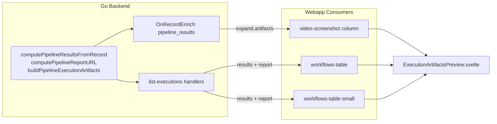

# Pipeline execution artifacts unification

**Date:** 2026-06-05  
**Status:** Approved  
**Surfaces:** `list-executions` API, scoreboard `video-screenshot` column, pipeline workflow tables

## Goal

Unify how pipeline execution artifacts (video, screenshot, log, report) are fetched and displayed across:

1. **Pipeline workflows UI** — `GET /api/pipeline/list-executions` and `GET /api/pipeline/list-executions/{id}`
2. **Scoreboard UI** — PocketBase `pipeline_scoreboard_cache` with expand `latest_successful_execution`

Today these paths duplicate grouping logic and return different shapes. Grouping lives only in Go; the webapp uses one shared preview component with two presentation variants.

## Decisions

| Topic | Choice |
|-------|--------|
| Overall approach | Shared canonical type; grouping only on backend (Go) |
| Scoreboard data path | `OnRecordEnrich("pipeline_results")` injects `artifacts` at read/expand time |
| UI | Single `ExecutionArtifactsPreview.svelte` with `variant: 'preview' \| 'compact'` |
| Out of scope | Denormalizing onto `pipeline_scoreboard_cache`; per-row REST endpoint; fixing `canonify.Resolve` fallback path; aligning `LastExecutionDetails` flat fields (phase 4) |

## Architecture



## Backend

### Helpers (`pkg/internal/apis/handlers/pipeline_results_handler.go`)

**Existing:** `computePipelineResultsFromRecord(app, record)` — groups video, screenshot, log by step key.

**New:**

- `computePipelineReportURL(app, record) string` — returns full file URL for the `report` field when present; empty string otherwise. URL pattern matches existing file URLs in `computePipelineResultsFromRecord` and `wallet_handler.go`.
- `buildPipelineExecutionArtifacts(app, record) PipelineExecutionArtifacts` — wraps results + report.

```go
type PipelineExecutionArtifacts struct {
	Results []PipelineResults `json:"results"`
	Report  string            `json:"report,omitempty"`
}
```

**GitNexus:** `computePipelineResultsFromRecord` has HIGH blast radius — run `gitnexus_impact` before editing.

### `WorkflowExecutionSummary` extension (`pkg/internal/apis/handlers/shared.go`)

Add top-level field:

```go
Report string `json:"report,omitempty"`
```

API responses expose flat `results[]` + `report?` on execution summaries (not nested `artifacts`).

### `list-executions` wiring

**`GET /api/pipeline/list-executions/{id}`** — already uses `fetchPipelineResultRecords` + `buildPipelineExecutionHierarchyFromResult`. Extend hierarchy builder to set `Results` and `Report` from `buildPipelineExecutionArtifacts`.

**`GET /api/pipeline/list-executions` (grouped)** — currently uses `buildExecutionHierarchyRaw` → `computePipelineResults` (broken `canonified_identifier` path). Fix: after `selectTopExecutionsByPipeline`, batch-fetch via `fetchPipelineResultRecords` and attach `Results` + `Report` to each selected summary using the same helper.

### PocketBase enrich (`OnRecordEnrich`)

**New package:** `pkg/internal/pipeline_results/` (mirrors `wallet_versions`).

```go
func RegisterPipelineResultsHooks(app core.App) {
	app.OnRecordEnrich("pipeline_results").BindFunc(HandlePipelineResultsEnrich)
}

func HandlePipelineResultsEnrich(e *core.RecordEnrichEvent) error {
	artifacts := handlers.BuildPipelineExecutionArtifacts(e.App, e.Record)
	e.Record.WithCustomData(true)
	e.Record.Set("artifacts", artifacts)
	return e.Next()
}
```

Register in `pkg/routes/routes.go` alongside `walletversions.WalletVersionHooks(app)`.

**Enriched record shape:**

```json
{
  "id": "...",
  "workflow_id": "...",
  "run_id": "...",
  "video_results": ["..."],
  "screenshots": ["..."],
  "artifacts": {
    "results": [
      { "video": "https://…", "screenshot": "https://…", "log": "https://…" }
    ],
    "report": "https://…"
  }
}
```

## Frontend

### Types and adapters (`webapp/src/lib/pipeline/execution-artifacts.ts`)

```ts
export type PipelineExecutionArtifacts = {
  results: Array<{ video: string; screenshot: string; log: string }>;
  report?: string;
};

export function fromApiSummary(summary: {
  results?: PipelineExecutionArtifacts['results'];
  report?: string;
}): PipelineExecutionArtifacts | undefined;

export function fromEnrichedRecord(record: {
  artifacts?: PipelineExecutionArtifacts;
}): PipelineExecutionArtifacts | undefined;
```

### Shared component (`webapp/src/lib/pipeline/results/execution-artifacts-preview.svelte`)

| Prop | Type | Notes |
|------|------|-------|
| `artifacts` | `PipelineExecutionArtifacts` | Required |
| `variant` | `'preview' \| 'compact'` | Default `'preview'` |
| `previewClass` | `string?` | Passed to MediaPreview (e.g. scoreboard `size-8!`) |
| `emptyState` | `Snippet` | Optional fallback when no artifacts |

**`variant="preview"`** — MediaPreview per step (video, screenshot, log file icon) + report Sheet with `RenderMD` (ported from `video-screenshot.svelte`).

**`variant="compact"`** — IconButton links (`VideoIcon`, `ImageIcon`, `FileCogIcon`) opening in new tab + report Sheet.

Report fetch: `fetch(reportUrl).then(res => res.text())` when `report` URL is non-empty.

### Consumer mapping

| Consumer | variant | Data source |
|----------|---------|-------------|
| `video-screenshot.svelte` | `preview` + `previewClass="size-8!"` | `fromEnrichedRecord(expand.latest_successful_execution)` |
| `workflows-table.svelte` | `preview` | `fromApiSummary(workflow)` |
| `workflows-table-small.svelte` | `compact` | `fromApiSummary(workflow)` |

### Cleanup

- Remove `groupExecutionArtifacts` from `video-screenshot.svelte`.
- Delete or re-export WIP `artifacts-buttons.svelte` in favor of shared component.
- Remove mock JSON early-return in `workflows.ts` once API verified.
- Extend `ExecutionSummary` in `workflows.ts` with `report?: string`.

## Testing

### Go

- `computePipelineReportURL` — with/without report file on record
- `buildPipelineExecutionArtifacts` — multi-step grouping including logs
- `HandleGetPipelineDetails` — grouped endpoint returns `results` + `report` when files exist
- `HandlePipelineResultsEnrich` — expanded record includes `artifacts` JSON

Run: `go test -tags=unit ./pkg/internal/apis/handlers/... -run 'PipelineReport|PipelineArtifacts|HandleGetPipelineDetails|PipelineResultsEnrich'`

### Webapp

- Unit tests for `fromApiSummary` / `fromEnrichedRecord`
- `cd webapp && bun run check`

### Pre-commit

- `gitnexus_impact` on `computePipelineResultsFromRecord`
- `gitnexus_detect_changes()` before commit

## Verification checklist

- [ ] `GET /api/pipeline/list-executions` returns `results[]` + `report` for executions with files
- [ ] `GET /api/pipeline/list-executions/{id}` returns same shape
- [ ] Scoreboard expand `latest_successful_execution` includes `artifacts` without client grouping
- [ ] Logs appear in scoreboard (currently missing)
- [ ] Report sheet works from shared component in both variants
- [ ] `make test` / targeted Go tests pass
- [ ] `cd webapp && bun run check` passes
