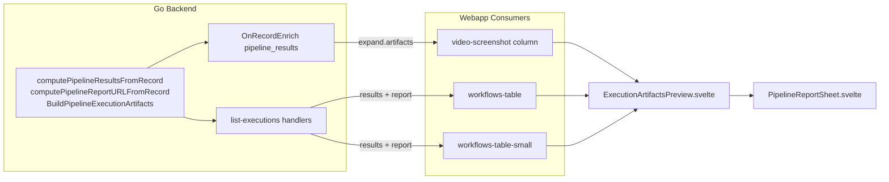

# Pipeline execution artifacts unification

**Date:** 2026-06-05 (revised 2026-06-05)  
**Status:** Approved (revised)  
**Approach:** A — revise-and-complete  
**Surfaces:** `list-executions` API, scoreboard `video-screenshot` column, pipeline workflow tables

## Goal

Unify how pipeline execution artifacts (video, screenshot, log, report) are fetched and displayed across:

1. **Pipeline workflows UI** — `GET /api/pipeline/list-executions` and `GET /api/pipeline/list-executions/{id}`
2. **Scoreboard UI** — PocketBase `pipeline_scoreboard_cache` with expand `latest_successful_execution`

Grouping lives only in Go. The webapp uses one shared media preview component (two presentation variants) that composes the existing `PipelineReportSheet` for reports.

## Current state (drift from original spec)

Work landed in #1237, #1238, and #1233 since the first draft. The following is already done:

| Item | Status |
|------|--------|
| `WorkflowExecutionSummary.Report` | Done (`shared.go`) |
| `computePipelineReportURLFromRecord` + `computePipelineReportURL` | Done |
| `computePipelineResultsFromRecord` (incl. logs) | Done |
| Per-pipeline `list-executions/{id}` Results + Report | Done (`buildPipelineExecutionHierarchyFromResult`) |
| `PipelineReportSheet.svelte` | Done — shared report Sheet with print |
| Workflow tables wired to API `results` + `report` | Done (inline rendering) |
| `workflows.ts` types + mock removal | Done |

Still missing:

| Item | Status |
|------|--------|
| `BuildPipelineExecutionArtifacts` wrapper + attach helpers | Not done |
| Grouped `list-executions` batch attach | Not done — still uses broken `canonify.Resolve` fallback |
| `OnRecordEnrich("pipeline_results")` | Not done |
| `execution-artifacts.ts` adapters | Not done |
| `ExecutionArtifactsPreview.svelte` | Not done |
| Scoreboard client-side grouping (no logs) | Not done |

## Decisions

| Topic | Choice |
|-------|--------|
| Overall approach | A — finish original spec, adapt to landed code |
| Grouping | Backend only (Go); no client-side `groupBy` |
| Scoreboard data path | `OnRecordEnrich("pipeline_results")` injects `artifacts` at read/expand time |
| Report UI | Keep `PipelineReportSheet.svelte`; shared preview composes it |
| Media UI | `ExecutionArtifactsPreview.svelte` with `variant: 'preview' \| 'compact'` |
| Helper naming | Keep `computePipelineReportURLFromRecord`; do not rename |
| Out of scope | Denormalizing onto `pipeline_scoreboard_cache`; per-row REST endpoint; fixing `canonify.Resolve` fallback path; aligning `LastExecutionDetails` flat fields |

## Architecture



## Backend

### Already implemented — do not rewrite

- `computePipelineResultsFromRecord(app, record)` — groups video, screenshot, log by step key (`logcats` + `ios_logstreams`)
- `computePipelineReportURLFromRecord(app, record)` — full file URL; handles `report` as string or string slice
- `computePipelineReportURL(app, owner, workflowID, runID)` — fallback via `canonify.Resolve`
- `WorkflowExecutionSummary.Report` in `shared.go`
- Per-pipeline hierarchy builder sets `Results` + `Report` from record when available

**GitNexus:** `computePipelineResultsFromRecord` has **HIGH** blast radius (3 direct callers, 4 affected processes). The new wrapper must delegate to it — do not modify its grouping logic.

### New glue (`pkg/internal/apis/handlers/`)

Add `PipelineExecutionArtifacts` struct (in `shared.go` or `pipeline_results_handler.go`):

```go
type PipelineExecutionArtifacts struct {
	Results []PipelineResults `json:"results"`
	Report  string            `json:"report,omitempty"`
}
```

New helpers in `pipeline_results_handler.go`:

```go
func BuildPipelineExecutionArtifacts(app core.App, record *core.Record) PipelineExecutionArtifacts
func attachPipelineArtifactsToSummary(summary *WorkflowExecutionSummary, app core.App, record *core.Record)
func attachPipelineArtifactsToSummaries(app core.App, ownerID string, summaries []*WorkflowExecutionSummary) error
```

`BuildPipelineExecutionArtifacts` wraps `computePipelineResultsFromRecord` + `computePipelineReportURLFromRecord`. No logic duplication.

API responses expose flat `results[]` + `report?` on execution summaries (not nested `artifacts`).

### `list-executions` wiring

**`GET /api/pipeline/list-executions/{id}`** — refactor `buildPipelineExecutionHierarchyFromResult` to call `attachPipelineArtifactsToSummary` when `resultRecord != nil`. Keep existing `canonify.Resolve` fallbacks for missing records.

**`GET /api/pipeline/list-executions` (grouped)** — after `selectTopExecutionsByPipeline` in `HandleGetPipelineDetails`, flatten selected summaries and call `attachPipelineArtifactsToSummaries(e.App, orgID, flatSummaries)`. This bypasses the broken `computePipelineResults` → `canonify.Resolve` path for the grouped view. Uses existing `fetchPipelineResultRecords`.

### PocketBase enrich (`OnRecordEnrich`)

**New package:** `pkg/internal/pipeline_results/` (mirrors `wallet_versions`).

```go
func RegisterPipelineResultsHooks(app core.App) {
	app.OnRecordEnrich("pipeline_results").BindFunc(HandlePipelineResultsEnrich)
}

func HandlePipelineResultsEnrich(e *core.RecordEnrichEvent) error {
	artifacts := handlers.BuildPipelineExecutionArtifacts(e.App, e.Record)
	e.Record.WithCustomData(true)
	e.Record.Set("artifacts", artifacts)
	return e.Next()
}
```

Register in `pkg/routes/routes.go` alongside `walletversions.WalletVersionHooks(app)`.

**Enriched record shape:**

```json
{
  "id": "...",
  "workflow_id": "...",
  "run_id": "...",
  "video_results": ["..."],
  "screenshots": ["..."],
  "artifacts": {
    "results": [
      { "video": "https://…", "screenshot": "https://…", "log": "https://…" }
    ],
    "report": "https://…"
  }
}
```

## Frontend

### Types and adapters (`webapp/src/lib/pipeline/execution-artifacts.ts`)

```ts
export type PipelineExecutionArtifacts = {
  results: Array<{ video: string; screenshot: string; log: string }>;
  report?: string;
};

export function fromApiSummary(summary: {
  results?: PipelineExecutionArtifacts['results'];
  report?: string;
}): PipelineExecutionArtifacts | undefined;

export function fromEnrichedRecord(record: {
  artifacts?: PipelineExecutionArtifacts;
}): PipelineExecutionArtifacts | undefined;
```

### Shared component (`webapp/src/lib/pipeline/results/execution-artifacts-preview.svelte`)

Handles **media artifacts only**. Composes existing `PipelineReportSheet` for report display — do not reimplement fetch/Sheet/print.

| Prop | Type | Notes |
|------|------|-------|
| `artifacts` | `PipelineExecutionArtifacts` | Required |
| `variant` | `'preview' \| 'compact'` | Default `'preview'` |
| `previewClass` | `string?` | Passed to MediaPreview (e.g. scoreboard `size-8!`) |
| `emptyState` | `Snippet` | Optional fallback when no artifacts |

**`variant="preview"`** — MediaPreview per step (video, screenshot, log file icon).

**`variant="compact"`** — IconButton links (`VideoIcon`, `ImageIcon`, `FileCogIcon`) opening in new tab.

**Report** — delegated to `PipelineReportSheet`:

```svelte
<PipelineReportSheet reportUrl={artifacts.report}>
  {#snippet sheetTrigger({ props })}
    <!-- variant-specific trigger -->
  {/snippet}
</PipelineReportSheet>
```

### Consumer mapping

| Consumer | variant | Data source | Change |
|----------|---------|-------------|--------|
| `video-screenshot.svelte` | `preview` + `previewClass="size-8!"` | `fromEnrichedRecord(expand.latest_successful_execution)` | Remove client `groupExecutionArtifacts`; gain logs |
| `workflows-table.svelte` | `preview` | `fromApiSummary(workflow)` | Extract inline MediaPreview loop |
| `workflows-table-small.svelte` | `compact` | `fromApiSummary(workflow)` | Extract inline IconButton loop |

`workflows.ts` — `report` + `results` types and mock removal already done. No further changes expected.

### Cleanup

- Remove `groupExecutionArtifacts`, `effect/Array.groupBy`, and `pb.files.getURL` grouping from `video-screenshot.svelte`
- Grep for stale `artifacts-buttons.svelte` references (file never landed)

## Testing

### Go

- `TestBuildPipelineExecutionArtifacts` — wrapper over existing record helpers
- Keep existing `TestComputePipelineReportURLFromRecord`
- Extend `TestHandleGetPipelineDetailsReturnsResults` — assert `results` + `report` when file fields set on `resultRecord`
- `TestHandlePipelineResultsEnrichSetsArtifacts` — new package test

Run: `go test -tags=unit ./pkg/internal/apis/handlers/... ./pkg/internal/pipeline_results/... -run 'PipelineReport|PipelineArtifacts|HandleGetPipelineDetails|PipelineResultsEnrich'`

### Webapp

- Unit tests for `fromApiSummary` / `fromEnrichedRecord` in `execution-artifacts.test.ts`
- `cd webapp && bun run check`

### Pre-commit

- `gitnexus_impact` on `computePipelineResultsFromRecord` before Go edits
- `gitnexus_detect_changes()` before commit

## Verification checklist

- [ ] `GET /api/pipeline/list-executions` returns `results[]` + `report` for executions with files
- [ ] `GET /api/pipeline/list-executions/{id}` returns same shape (unchanged behavior)
- [ ] Scoreboard expand `latest_successful_execution` includes `artifacts` without client grouping
- [ ] Logs appear in scoreboard (currently missing)
- [ ] All three surfaces use `ExecutionArtifactsPreview` + `PipelineReportSheet`
- [ ] Report sheet + print work from all surfaces
- [ ] `make test` / targeted Go tests pass
- [ ] `cd webapp && bun run check` passes
