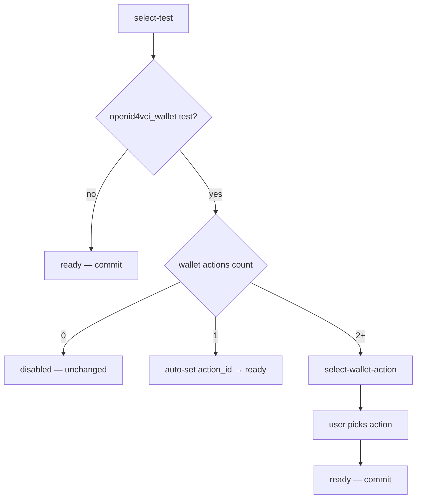

# OpenID4VCI Wallet Conformance Check — Action Picker Design Spec

**Date:** 2026-06-06  
**Status:** Approved (design interview)  
**Scope:** When selecting an `openid4vci_wallet*` conformance check and the execution-target wallet has **more than one** PocketBase `wallet_actions` record with category `get-credential-generic`, show a funnel step to pick which action to bind. Builds on the disabled-state spec (`2026-06-06-openid4vci-wallet-check-disabled-state-design.md`).

**Parent feature:** OpenID4VCI wallet check pipeline-form UX (#1232 follow-up).

---

## Summary

Today, after wallet preconditions pass, `testOptions` uses `.find()` on `walletActions.current` and silently binds the **first** `get-credential-generic` action. Wallets with multiple actions of that category give users no choice and may serialize the wrong `action_id`.

**Change:** Extend the conformance-check funnel with a `select-wallet-action` step when count ≥ 2. When exactly one action exists, skip the step and auto-bind (unchanged UX). Action picker cards match the wallet-action step form styling.

**Out of scope (v1):** Choosing among pipeline `mobile-automation` steps; search/pagination for actions; new i18n keys; general eligibility framework.

---

## Problem

| Scenario | Current behavior | Desired behavior |
|----------|------------------|------------------|
| Wallet has 1 `get-credential-generic` action | Auto-bind first (only) action | Auto-bind — one click to `ready` |
| Wallet has 2+ `get-credential-generic` actions | Auto-bind first silently | Funnel step to pick action |
| Non-wallet check | No action step | Unchanged |
| Edit step with existing `action_id` | Loads as ready | Breadcrumb shows test + action |
| Suite with single wallet test + 2+ actions | Auto-select test, silent first action | Auto-select test, then action picker |

---

## Decisions

| Topic | Decision |
|-------|----------|
| What “multiple” means | Multiple **`wallet_actions`** records on execution-target wallet with category `get-credential-generic` |
| Picker UX | **New funnel step** `select-wallet-action` (matches wallet-action pattern) |
| Single action | **Skip** action step — auto-set `action_id` on test select |
| Action card display | **Match wallet-action picker** — name, category label, tags/badges |
| Data source | Reuse existing `walletActions` resource (no second PocketBase fetch) |
| Approach | **Approach 1** — extend `ConformanceCheckStepForm` state machine |
| Safety net | Keep `serialize()` throw in `conformance-check/index.ts` if `action_id` missing |

---

## Architecture

### State machine

Add `'select-wallet-action'` to `FormState`.

**`state` derived (wallet tests):**

| Condition | State |
|-----------|-------|
| standard + version + suite, no test | `select-test` |
| test set, wallet test, 2+ actions, no `action_id` | `select-wallet-action` |
| test set, (non-wallet OR `action_id` set) | `ready` |

Non-wallet tests reach `ready` immediately after `selectTest()` without an action step.

### Data flow

1. **`walletActions` resource** — unchanged; keyed on `ExecutionTarget.state.current?.wallet?.id`; fetches actions filtered by `get-credential-generic`.
2. **`getGenericCredentialActions()`** — helper returning `walletActions.current ?? []` (or filtered list).
3. **`testOptions`** — drop pre-resolved `action_id`; eligibility unchanged.
4. **`selectTest(option)`** — sets `test`; branches on action count for wallet tests (see Logic).
5. **`selectWalletAction(action)`** — sets `action_id = getPath(action)`; commits on add intent.
6. **Breadcrumb** — when `action_id` set, resolve display name from `walletActions.current` by path match.

### Discard hierarchy

| Method | Clears | Resulting state |
|--------|--------|-----------------|
| `discardWalletAction()` | `action_id` | `select-wallet-action` (if wallet test + 2+ actions) |
| `discardTest()` | `test`, `action_id` | `select-test` |
| `discardSuite()` / up | cascades including `action_id` | earlier funnel step |

---

## UI

### Breadcrumb (selection summary)

When `action_id` is set, show a row:

- **Label:** `m.Wallet_action()`
- **Title:** resolved action `name`
- **Discard:** `discardWalletAction()`

On edit/deserialize, show once `walletActions` resolves the stored `action_id`.

### Action picker (`select-wallet-action`)

- **Section label:** `m.Select_item({ item: m.Wallet_action().toLowerCase() })` (same pattern as other steps)
- **List:** `{#each}` over `getGenericCredentialActions()` — no search/pagination
- **Card markup:** match `wallet-action-step-form.svelte` action picker:
  - Title: `action.name`
  - `beforeContent`: `Wallet.Action.getCategoryLabel(record)`
  - `afterContent`: `WalletActionTags` + private `Badge` when `!record.published`

### Test picker

Unchanged visually: grouped notice (spinner/amber alert), disabled wallet tests, enabled wallet tests clickable. Logic change only — no silent multi-action bind.

### `selectLabel`

Map `'select-wallet-action'` → `m.Wallet_action()`.

---

## Logic details

### `getWalletTestBlockReason()`

Unchanged. “No actions” blocks wallet tests. Multiple actions is **not** a block reason.

### `selectTest(option)`

1. Early return if `!option.enabled`
2. Set `this.data.test`
3. If test does not start with `openid4vci_wallet`:
   - Commit on add intent → `ready`
4. If wallet test:
   - `actions = getGenericCredentialActions()`
   - `actions.length === 1` → set `action_id = getPath(actions[0])`, commit on add intent
   - `actions.length >= 2` → clear `action_id`, stay on `select-wallet-action` (no commit)

### `selectWalletAction(action)`

Set `action_id = getPath(action)`. Commit on add intent.

### `selectSuite()` auto-select

When `availableTests.length === 1` and option enabled:

- Non-wallet test → `selectTest(option)` (completes)
- Wallet test + 1 action → `selectTest(option)` (completes)
- Wallet test + 2+ actions → `selectTest(option)` (selects test only; user picks action)

### Edit / deserialize

`deserialize` already returns `action_id`. Form initializes as `ready` with test + action breadcrumb once actions load.

---

## Error handling

| Edge case | Behavior |
|-----------|----------|
| Stored `action_id` not in reloaded actions | Treat as missing action — existing block/alert path |
| User discards wallet action | Back to action picker; test remains selected |
| `intent === 'edit'` | Funnel works; commit only on explicit save (`BaseForm` pattern) |
| Actions still loading | Wallet tests disabled — unchanged from disabled-state spec |

---

## File changes

| File | Change |
|------|--------|
| `webapp/src/lib/pipeline-form/steps/conformance-check/conformance-check-step-form.svelte.ts` | State machine, helpers, `selectTest` / `selectWalletAction` / `discardWalletAction`, auto-select guard |
| `webapp/src/lib/pipeline-form/steps/conformance-check/conformance-check-step-form.svelte` | Breadcrumb row, `select-wallet-action` block, wallet-action card imports |
| Optional: `webapp/src/lib/pipeline-form/steps/_partials/wallet-action-item-card.svelte` | Extract shared card if duplication is awkward |

**Unchanged:** `conformance-check/index.ts` `serialize()` / `deserialize()` / `cardData`.

---

## Testing

### Manual UAT

1. Wallet with **1** `get-credential-generic` action → one click completes; YAML has correct `action_id`
2. Wallet with **2+** actions → test click → action picker → chosen `action_id` in YAML
3. **Discard** action → action picker; discard test → test picker
4. Single-test suite + **multiple actions** → auto-selects test only, then action picker
5. **Edit** existing step → breadcrumb shows test + action; save preserves `action_id`
6. Non-wallet tests → no action step
7. Disabled states (no wallet / no action / loading) → unchanged from prior spec

### Unit tests

Optional v1: table-driven tests for `selectTest` branching (`actionCount: 0 | 1 | 2+`). Prefer manual UAT for v1 scope.

---

## Implementation notes

- Reuse `OPENID4VCI_WALLET_ACTION_CATEGORY = 'get-credential-generic'`.
- Do not use `StepCollectionPicker` for this step — list is pre-filtered and small; avoids duplicate fetch.
- Optional partial extraction is a polish step, not a blocker.
- Eligibility must still react when `ExecutionTarget` or `walletActions` changes.
