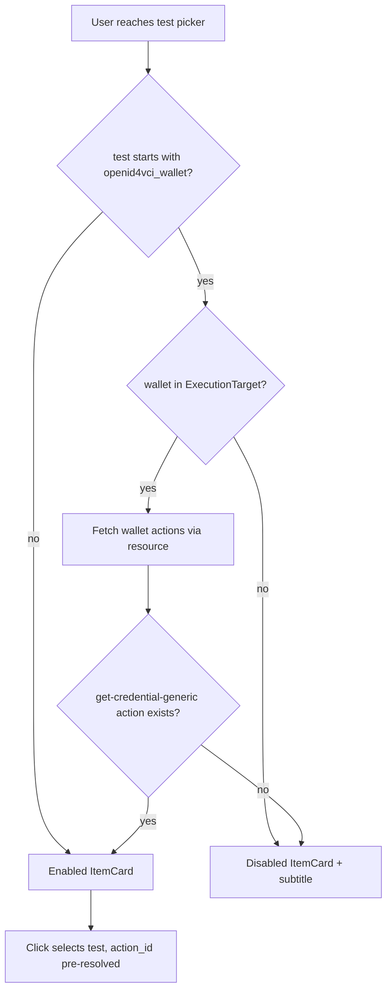

# OpenID4VCI Wallet Conformance Check — Disabled State Design Spec

**Date:** 2026-06-06  
**Status:** Approved (design interview)  
**Scope:** Disable (instead of error-on-click) `openid4vci_wallet*` conformance checks in the pipeline form when preconditions are not met. Wallet-only v1; visible subtitle explains why a check is disabled.

---

## Summary

Today, every test in the conformance-check funnel is clickable. Selecting an `openid4vci_wallet*` test runs async validation in `selectTest()` and shows a toast if:

1. No wallet exists in `ExecutionTarget` (derived from the last `mobile-automation` step), or
2. The wallet has no `get-credential-generic` action in PocketBase.

This is poor UX: users discover requirements only after a failed click. Auto-select when a suite has a single test can also trigger the same error.

**Change:** Prefetch wallet actions when a wallet is present, derive per-test eligibility before render, and show ineligible wallet checks as **disabled `ItemCard`s with a visible subtitle**. Clicks on disabled checks do nothing. Auto-select skips disabled tests.

**Out of scope (v1):** General eligibility framework for other check types, disabling at standard/suite level, new i18n keys, hiding ineligible tests.

---

## Problem

| Scenario | Current behavior | Desired behavior |
|----------|------------------|------------------|
| No wallet step before conformance check | Toast on click | Disabled card + subtitle |
| Wallet step present, missing `get-credential-generic` action | Toast on click | Disabled card + subtitle |
| Wallet + action present | Selectable | Selectable (unchanged) |
| Suite with one disabled wallet test | Auto-select → toast | Stay on picker, show disabled card |
| Non-wallet checks | Always clickable | Always clickable (unchanged) |

---

## Decisions

| Topic | Decision |
|-------|----------|
| Disabled reason UX | **Visible subtitle** under check name (not tooltip-only) |
| Single-test suite, test disabled | **Stay on test picker** — show the disabled card, no auto-select |
| Scope | **Wallet-only** — hardcode `openid4vci_wallet*` preconditions; no generic eligibility plugin |
| Approach | **Approach 1** — prefetch wallet actions via `resource()`, derive `testOptions` |
| Loading | Wallet checks **disabled** while actions fetch; subtitle uses existing `Loading()` key |
| Safety net | Keep `serialize()` throw in `conformance-check/index.ts` for edit/deserialize edge cases |

---

## Architecture



### Preconditions (unchanged logic, evaluated earlier)

| Condition | Disabled subtitle (existing i18n) |
|-----------|-----------------------------------|
| No wallet in `ExecutionTarget` | `Pipeline_form_choose_wallet_before_openid4vci_wallet_check` |
| Wallet set, actions loading | `Loading()` |
| Wallet set, no `get-credential-generic` action | `Pipeline_form_wallet_missing_action_category` |

Non-wallet tests are always enabled with no subtitle.

### Data flow

1. **`walletActions` resource** — keyed on `ExecutionTarget.state.current?.wallet?.id`; fetches `wallet_actions` filtered by wallet + category `get-credential-generic` (same query as today’s `getOpenID4VCIWalletActionId()`).
2. **`testOptions` derived list** — maps `availableTests` to `{ test, testName, enabled, subtitle?, action_id? }`.
3. **Template** — iterates `testOptions`; passes `disabled`, `subtitle`, and conditional `onClick` to `ItemCard`.
4. **`selectTest(option)`** — synchronous for enabled tests; sets `test` and pre-resolved `action_id`; early-returns if `!option.enabled`.
5. **`selectSuite()` auto-select** — only when `availableTests.length === 1` **and** that test is enabled in `testOptions`.

---

## UI: `ItemCard` disabled state

**New prop:** `disabled?: boolean` (default `false`).

When `disabled={true}`:

- Render `<button disabled>` for accessibility
- Apply muted styling: `disabled:cursor-not-allowed`, no `hover:ring`
- Do not attach `onClick` — no toast on click
- Show disable reason via existing **`subtitle`** prop
- Hide arrow icon

When enabled: behavior unchanged.

### Conformance check test picker (conceptual)

```svelte
{#each form.testOptions as option (option.test)}
	<ItemCard
		title={option.testName}
		subtitle={option.subtitle}
		disabled={!option.enabled}
		onClick={option.enabled ? () => form.selectTest(option) : undefined}
	/>
{/each}
```

---

## File changes

| File | Change |
|------|--------|
| `webapp/src/lib/pipeline-form/steps/_partials/item-card.svelte` | Add `disabled` prop + disabled button styling |
| `webapp/src/lib/pipeline-form/steps/conformance-check/conformance-check-step-form.svelte.ts` | Add `walletActions` resource; `testOptions` derived; refactor `selectTest()`; guard auto-select |
| `webapp/src/lib/pipeline-form/steps/conformance-check/conformance-check-step-form.svelte` | Iterate `testOptions` instead of `availableTests` |

**Unchanged (safety net):** `conformance-check/index.ts` `serialize()` still throws if `action_id` is missing for wallet checks.

**Removed from hot path:** async throw in `selectTest()` on click for missing wallet/action (logic moves to eligibility derivation).

---

## Testing

### Manual UAT

1. Pipeline with **no wallet step** → wallet checks disabled, subtitle prompts to choose wallet first
2. Pipeline with wallet step but **no `get-credential-generic` action** → disabled + missing-category subtitle
3. Pipeline with wallet + action → wallet checks enabled, selectable, YAML serializes with `action_id`
4. Suite with **single disabled wallet test** → stays on picker, one disabled card, no toast
5. Suite with **single enabled test** → auto-select still works
6. Non-wallet checks → always enabled regardless of execution target

### Unit tests

Optional v1: extract a pure `getWalletTestEligibility({ test, wallet, actions, loading })` helper for table-driven tests. Not required if UAT covers the matrix; prefer manual UAT for wallet-only scope.

---

## Implementation notes

- Reuse `OPENID4VCI_WALLET_ACTION_CATEGORY = 'get-credential-generic'` constant.
- Eligibility must react when `ExecutionTarget.state.current` changes (e.g. user adds a wallet step before opening conformance check).
- Do not filter out disabled tests from the list — they remain visible with explanation.
- `item-card.svelte` async error handler (`showPipelineFormError`) remains for other callers; disabled wallet checks never reach it via click.

---

## Addendum (2026-06-06): Grouped notice above test list

**Status:** Approved  
**Replaces:** Per-card subtitles for wallet-check disable reasons.

### Change

When `openid4vci_wallet*` tests are disabled for a shared precondition, show **one notice above the test list** instead of repeating the same subtitle on every disabled card.

| Condition | Above-list UI |
|-----------|---------------|
| Suite has wallet tests + wallet set + actions loading | Compact **spinner** + `Loading()` (not yellow alert) |
| Suite has disabled wallet tests + actions resolved | **Yellow alert** (`border-amber-200 bg-amber-50 text-amber-800`) with shared message |
| All wallet tests enabled, or no wallet tests in suite | Nothing |

Disabled wallet cards keep muted/disabled styling only — **no subtitle**.

Mixed suites: alert explains wallet precondition; non-wallet tests remain enabled below.

### Implementation

- `testPickerNotice` derived on form: `{ kind: 'none' | 'loading' | 'alert' }`
- `getWalletTestBlockReason()` shared helper for alert message + eligibility
- `TestOption` drops `subtitle` field
- Template renders notice then list in `select-test` state
