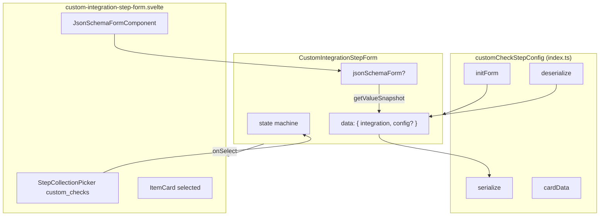

# Pipeline Custom Integration Config Form — Design Spec

**Date:** 2026-06-06  
**Status:** Approved (design interview)  
**Scope:** Frontend pipeline form composer — replace `HubItemStepForm` for `custom-check` steps with a dedicated form that picks from `custom_checks`, renders a JSON schema config form when the integration defines one, and serializes/deserializes `with.config`.

---

## Summary

The `custom-check` pipeline step currently uses the generic `HubItemStepForm`, which only selects a hub item and serializes `{ check_id }`. Custom integrations can define `input_json_schema` on the `custom_checks` collection; the standalone run page already renders this via `CustomCheckConfigEditor` + `JsonSchemaFormComponent`.

This change introduces **`CustomIntegrationStepForm`**: a dedicated step form that queries `custom_checks` directly (owned + published), shows a JSON schema config form when applicable, and persists user input in `with.config` as `Record<string, unknown>`.

**Out of scope (this phase):** backend wiring of `with.config` to `CustomCheckWorkflow` `Config.env`; refactoring `CustomCheckConfigEditor` on the run page; inline `with.yaml` on pipeline steps.

---

## Problem

| Gap | Detail |
|-----|--------|
| No config UI | Pipeline form never collects integration input fields |
| Wrong data source | `hub_items` view lacks `input_json_schema` / `input_json_sample` |
| Schema already supported in YAML | Pipeline schema allows `with.config` on `custom-check` steps, but form never sets it |
| Runtime gap (follow-up) | Standalone runs pass form data as `Config.env` (JSON string); pipeline workflow reads `env` but not step-level `config` |

---

## Decisions

| Topic | Decision |
|-------|----------|
| Form class | **Replace** `HubItemStepForm` for `custom-check` with dedicated `CustomIntegrationStepForm` |
| Picker collection | **`custom_checks`** via `StepCollectionPicker` / `CollectionManager` |
| Picker filter | **`(owner.id = "{orgId}") \|\| (published = true)`** — org-owned + published hub integrations |
| Org context | **`userOrganization`** from `$lib/app-state` |
| Config validation | **Required** when `input_json_schema` exists; must pass `@sjsf/form` validation |
| Config shape | **`config?: Record<string, unknown>`** in form data; serialized to `with.config` |
| Backend | **Frontend only** this phase; runtime config consumption is a separate follow-up |
| Approach | **Multi-state form** (Approach 1) — consistent with `ConformanceCheckStepForm` / `WalletActionStepForm |

---

## Architecture



### File layout

```
webapp/src/lib/pipeline-form/steps/custom-integration/
├── index.ts
├── custom-integration-step-form.svelte.ts
└── custom-integration-step-form.svelte
```

Remove `customCheckStepConfig` from `hub-item/index.ts`. Update `steps/index.ts` import. `HubItemStepForm` remains for `credential-offer` and `use-case-verification-deeplink`.

---

## Form data model

```typescript
type CustomIntegrationStepFormData = {
  integration: CustomChecksResponse;
  config?: Record<string, unknown>;
};
```

- **`integration`** — full `custom_checks` record from picker (includes `input_json_schema`, `input_json_sample`)
- **`config`** — JSON schema form values; only meaningful when schema exists

---

## State machine

| State | Condition | UI |
|-------|-----------|-----|
| `select-integration` | No integration selected | `StepCollectionPicker` |
| `configure` | Integration selected, has schema, not yet valid/saved | Selected card + `JsonSchemaFormComponent` |
| `ready` | Integration selected; no schema, or schema valid | Selected card (+ config form in edit mode) |

### UX by mode

| Scenario | Behavior |
|----------|----------|
| **Add, no schema** | Select integration → auto-commit (same as current hub step) |
| **Add, has schema** | Select integration → show config form → explicit save via add button / panel save |
| **Edit, no schema** | Show selected integration; can re-pick |
| **Edit, has schema** | Restore config into `createJsonSchemaForm(schema, { initialValue: config })` |
| **Discard / re-pick** | Clear integration, config, and json schema form instance |

### Validation (`canSave`)

- **No schema:** `integration !== undefined`
- **Has schema:** integration selected **and** `validate(jsonSchemaForm).errors` is empty

Reuse patterns from `CustomCheckConfigEditor` (`getValueSnapshot`, `validate` from `@sjsf/form`).

---

## Serialize / deserialize

### serialize

```typescript
(formData: CustomIntegrationStepFormData) => ({
  check_id: getPath(formData.integration, true),
  ...(formData.config && Object.keys(formData.config).length > 0
    ? { config: formData.config }
    : {})
})
```

Omit `config` when empty or when integration has no schema.

### deserialize

```typescript
async ({ check_id, config }) => {
  if (!check_id) throw new Error(/* i18n missing check_id */);
  const integration = await getRecordByCanonifiedPath<CustomChecksResponse>(check_id);
  if (integration instanceof Error) throw integration;
  return {
    integration,
    config: config as Record<string, unknown> | undefined
  };
};
```

If integration has schema but saved config is missing or fails validation, form opens in `configure` state with validation errors blocking save.

---

## Picker configuration

```typescript
collection: 'custom_checks'
queryOptions: {
  filter: `(owner.id = "${orgId}") || (published = true)`,
  searchFields: ['name'],
  expand: ['owner']
}
```

Item snippet: logo via `pb.files.getURL(record, record.logo)`, name, subtitle from `record.expand?.owner?.name`.

---

## UI layout (when schema exists)

```
┌─ Selected integration (ItemCard + discard) ─┐
├─ Fields (JsonSchemaFormComponent)           ─┤  hideSubmitButton
└─ [Add step] (add mode only)                 ─┘
```

No YAML editor in pipeline step form — runtime YAML is resolved from the integration record via `check_id`.

---

## Card display

Unchanged from current hub-item card behavior:

- Title: integration name
- Avatar: logo file
- Public URL: `getCustomCheckPublicUrl(integration)`
- `makeId`: last path segment of `check_id`

No config summary meta in v1.

---

## Error handling

| Case | Behavior |
|------|----------|
| `check_id` missing on deserialize | Throw i18n error (reuse existing `Pipeline_form_missing_check_id` or equivalent) |
| Record not found | Propagate `getRecordByCanonifiedPath` error → `Enrich404Error` via existing enrich path |
| Schema validation failure | Disable save; show form field errors via `@sjsf/form` |
| Serialize failure | Existing `showPipelineFormError` in `StepsBuilder` |

---

## Testing

| Area | Approach |
|------|----------|
| `serialize` / `deserialize` | Unit tests in `custom-integration/index.test.ts` (or co-located with config) |
| `canSave` logic | Unit test form class with/without schema |
| JSON schema form integration | Prefer pure tests on serialize round-trip; optional component test if patterns exist |

No E2E required for v1 unless existing pipeline form E2E covers step add/edit.

---

## Follow-up (not this phase)

1. **Backend:** Pipeline setup hook or workflow change to marshal `with.config` → `CustomCheckWorkflow` `Config.env` (JSON string), matching standalone `/api/custom-integrations/run` behavior.
2. **Optional DRY:** Extract shared json-schema config block from run page `CustomCheckConfigEditor`.

---

## References

- Standalone config editor: `webapp/src/routes/my/custom-integrations/(reset)/[...path]/run/_partials/custom-check-config-editor.svelte.ts`
- JSON schema form: `webapp/src/modules/components/json-schema-form/`
- Pipeline schema `custom-check` `with.config`: `schemas/pipeline/pipeline_schema.json`
- Current step config: `webapp/src/lib/pipeline-form/steps/hub-item/index.ts` (`customCheckStepConfig`)
