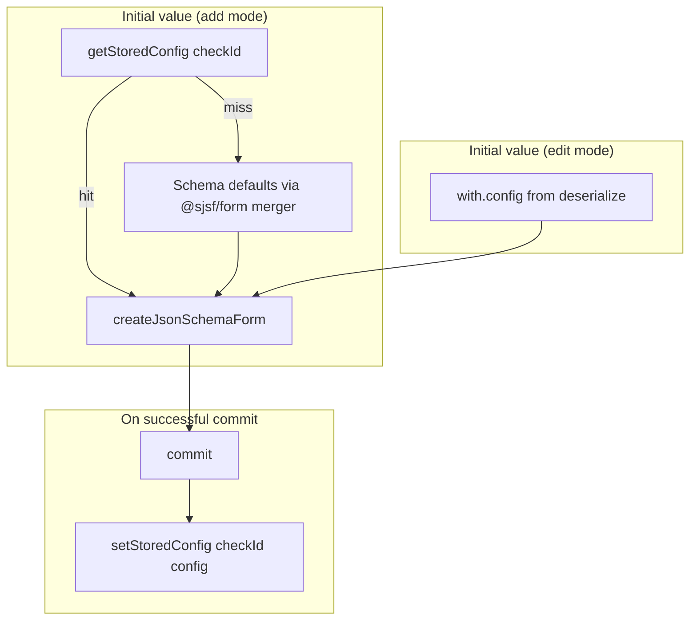

# Pipeline Custom Integration Config Persistence — Design Spec

**Date:** 2026-06-06  
**Status:** Approved (design interview)  
**Scope:** Frontend pipeline form composer — change how `CustomIntegrationStepForm` pre-fills JSON schema config fields, and persist last-committed config per integration in `localStorage` for reuse on later selections.

**Builds on:** `docs/superpowers/specs/2026-06-06-pipeline-custom-integration-config-form-design.md`

---

## Summary

Today, when a user selects a custom integration in **add** mode, the JSON schema form pre-fills from `integration.input_json_sample` (author-provided sample data on the `custom_checks` record). That conflates demo/sample data with what the user actually wants to run.

This change:

1. Pre-fills **only** from JSON Schema `default` values (via `@sjsf/form` merger when no explicit `initialValue` is passed).
2. After a successful commit (Add step or Save in edit), persists config to **localStorage** keyed by integration.
3. On re-selecting the same integration in add mode, restores the last committed config from localStorage.

Edit mode continues to load config from the pipeline step's saved `with.config` (deserialize), not localStorage.

---

## Problem

| Gap | Detail |
|-----|--------|
| Wrong pre-fill source | `input_json_sample` is author demo data, not user intent or schema defaults |
| No cross-session memory | Users re-enter the same integration config every time they add a step |
| Inconsistent with schema | Sample data may include values that aren't schema defaults and may not validate |

---

## Decisions

| Topic | Decision |
|-------|----------|
| Pre-fill in add mode (no localStorage) | **`undefined` initialValue** → `@sjsf/form` merger applies JSON Schema `default` keywords only |
| Pre-fill in add mode (localStorage hit) | Last committed config for that integration |
| Pre-fill in edit mode | Saved `with.config` from pipeline YAML (deserialize) — **never** localStorage |
| `input_json_sample` in pipeline form | **Not used** |
| localStorage scope | **Per integration**, browser-wide (shared across pipelines) |
| localStorage key | Single store `pipeline_custom_integration_configs`; value shape `Record<checkId, config>` |
| Integration key (`checkId`) | Canonified path via `getPath(integration, true)` — same as serialized `check_id` |
| Write timing | On every successful `commit()` when config is present (add **Add step** and edit **Save**) |
| Stale localStorage | **Load anyway**; show validation errors; gate Add/Save via existing `isValid` |
| Storage util | `createStorageHandlers` from `@/utils/storage` (matches `LatestCheckRunsStorage` pattern) |
| Standalone run page | **Out of scope** — `CustomCheckConfigEditor` keeps using `input_json_sample` |
| Logout | Existing `localStorage.clear()` on logout clears saved configs — acceptable |

---

## Initial value resolution

Priority when calling `createJsonSchemaForm(schema, { initialValue })`:

| # | Condition | `initialValue` |
|---|-----------|----------------|
| 1 | Edit mode / deserialize (`initialConfig` passed) | Pipeline step `with.config` |
| 2 | Add mode, localStorage hit for `checkId` | Stored config |
| 3 | Add mode, no localStorage | `undefined` (schema defaults only) |

```typescript
function resolveInitialConfig(
  integration: CustomChecksResponse,
  explicitConfig?: Record<string, unknown>
): Record<string, unknown> | undefined {
  if (explicitConfig !== undefined) return explicitConfig;
  return getStoredConfig(getPath(integration, true)) ?? undefined;
}
```

**Do not** fall back to `integration.input_json_sample`.

---

## localStorage module

New file: `webapp/src/lib/pipeline-form/steps/custom-integration/config-storage.ts`

```typescript
type CustomIntegrationConfigStore = Record<string, Record<string, unknown>>;

const STORAGE_KEY = 'pipeline_custom_integration_configs';
const storage = createStorageHandlers<CustomIntegrationConfigStore>(STORAGE_KEY, localStorage);

export function getStoredConfig(checkId: string): Record<string, unknown> | undefined;
export function setStoredConfig(checkId: string, config: Record<string, unknown>): void;
```

Implementation notes:

- Wrap reads/writes in try/catch; log errors and degrade gracefully (same pattern as `webapp/src/lib/pipeline/runner/binding.ts`).
- `setStoredConfig` merges into the existing store object (read-modify-write) so other integrations' configs are preserved.
- Browser guard via `createStorageHandlers` — safe if called outside browser (returns null / no-op).

---

## Form integration

Changes in `custom-integration-step-form.svelte.ts`:

### `initJsonSchemaForm`

Replace:

```typescript
initialValue: initialConfig ?? integration.input_json_sample ?? undefined
```

With:

```typescript
initialValue: resolveInitialConfig(integration, initialConfig)
```

Where `initialConfig` is only passed from constructor (edit/deserialize) — not from `selectIntegration`.

### `selectIntegration` (add mode)

```typescript
this.initJsonSchemaForm(integration); // no explicit config → localStorage → schema defaults
```

### `commit` override

After successful commit with valid config payload, persist:

```typescript
commit(data?: Deserialized) {
  const payload = data ?? this.getSubmitData();
  if (payload === undefined) return;
  super.commit(payload);
  if (payload.config && payload.integration) {
    setStoredConfig(getPath(payload.integration, true), payload.config);
  }
}
```

Note: capture payload before `super.commit`; persistence runs only when commit would succeed (valid payload).

---

## Architecture



---

## File layout

```
webapp/src/lib/pipeline-form/steps/custom-integration/
├── config-storage.ts                          (new)
├── config-storage.test.ts                     (new)
├── custom-integration-step-form.svelte.ts     (resolve + persist)
└── custom-integration-step-form.test.ts       (updated)
```

No changes to `index.ts`, Svelte view, or standalone run page.

---

## UX scenarios

| Scenario | Expected behavior |
|----------|-------------------|
| Add, first time, schema with defaults | Fields show schema default values only |
| Add, first time, schema without defaults | Empty fields; Add step disabled until valid |
| Add, re-select same integration | Last committed config pre-filled |
| Edit existing step | Pipeline YAML config pre-filled (ignores localStorage) |
| Edit, Save | Updates localStorage for that integration |
| Schema changed, stale localStorage | Stale config loaded; validation errors shown; Add/Save disabled until fixed |
| Logout | Saved configs cleared with rest of localStorage |

---

## Testing

### Unit — `config-storage.test.ts`

- `getStoredConfig` returns undefined when empty
- `setStoredConfig` / `getStoredConfig` round-trip
- Multiple integrations stored independently
- Graceful handling when localStorage throws

### Unit — `custom-integration-step-form.test.ts`

- `selectIntegration` does not use `input_json_sample`
- Add mode: uses localStorage when present
- Add mode: no localStorage → form created without explicit initialValue
- Edit mode: explicit config from `initial` wins over localStorage
- `commit` persists config to storage (mock storage module)

### Manual

1. Add integration with schema defaults → only defaults shown (not sample data)
2. Fill config, Add step → re-add same integration → values restored
3. Edit step → YAML values shown, not a different localStorage value
4. Save edit → localStorage updated
5. Change integration schema (add required field) → stale config loads with errors

---

## Out of scope

- Backend `with.config` → workflow runtime wiring
- Shared persistence with standalone run page (`CustomCheckConfigEditor`)
- Per-org or per-pipeline localStorage scoping
- Partial merge / auto-discard of stale localStorage
- Schema-version hashing or TTL on stored configs

---

## Follow-up (optional)

- Apply same localStorage pattern to standalone run page if users want parity
- Clear stored config when integration record is deleted (would need a hook)
