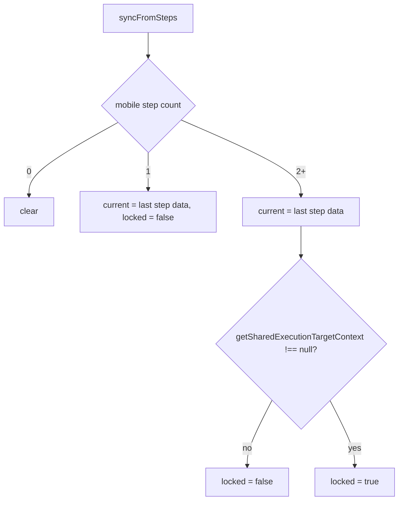

# Execution Target — Edge Cases Design Spec

**Date:** 2026-06-25  
**Status:** Approved (design interview)  
**Scope:** Fix `ExecutionTarget` lifecycle and locking in the pipeline form (`webapp/src/lib/pipeline-form/execution-target/`, `steps-builder`, `wallet-action` step) for mobile-automation step add/edit/delete edge cases.

---

## Summary

`ExecutionTarget` holds the pipeline-level wallet / version / runner used to prefill new mobile-automation steps and drive conformance-check wallet lookups. Today it is set on pipeline load and action selection but **not** cleared when the last mobile step is deleted, and field locking is tied to `runner === 'global'` instead of a pipeline-level **locked** state.

**Changes:**

1. Sync `ExecutionTarget` from the steps list after every builder mutation; **clear** when zero mobile steps remain.
2. Add pipeline-level **`locked`** on `ExecutionTarget`, set when the 2nd mobile step commits unchanged from prefill.
3. Replace `hasGlobalRunner()` discard gating with `locked` + “add 3rd+” rules.
4. Enforce: **two different wallets in the pipeline cannot use a global runner**.

**Out of scope (v1):** Propagating step-1 target edits to all mobile steps when unlocked; auto-global refinement (`only when form runner unset`); E2E tests.

---

## Problem

| Scenario | Current behavior | Desired behavior |
|----------|------------------|------------------|
| Delete last `mobile-automation` step | `ExecutionTarget` may stay stale | `clear()` — `current` and `locked` reset |
| 1 mobile step, runner `'global'` | Discard hidden on wallet/version/runner (`hasGlobalRunner`) | Target fields fully editable |
| Add 2nd mobile step | Prefilled; discard rules inconsistent | Prefilled; **still editable** (last chance to diverge) |
| 2nd step committed with same target as prefill | No lock concept | `locked = true`; target not editable on any mobile step |
| Add 3rd+ mobile step | Same as 2nd | Prefilled; target **always locked** (action only) |
| Edit step 1 or 2 when `locked` | May still allow target edits | Target locked; **action only** |
| Two mobile steps with different wallets | Global runner may still be selectable | Global runner **not allowed** |

---

## Decisions

| Topic | Decision |
|-------|----------|
| Lock storage | **`ExecutionTarget.state.locked`** — pipeline-level boolean alongside `current` |
| When `locked` becomes `true` | 2nd `mobile-automation` step commits with same wallet, version, and runner as prefill snapshot |
| When `locked` becomes `false` | &lt; 2 mobile steps; 2nd step committed with changed target; all mobile steps removed |
| Target editable while `locked` | **No** — any mobile step edit: action only |
| Add 2nd step | Prefilled, target **editable** even if `ExecutionTarget` exists |
| Add 3rd+ step | Prefilled, target **always locked** (independent of `locked` flag timing) |
| Unlock without delete | **No** — structural only (delete mobile steps) |
| Auto-global on wallet/version select | **Keep** existing behavior |
| Multi-wallet + global runner | **Invalid** — hide/disable “choose later”; validate on save |
| Lock detection helper | Extend or sibling to `getBulkWalletVersionContext` for shared-target equality (wallet + version + runner) |
| Form lock input | Read `ExecutionTarget.locked` + add intent + mobile step count in form / view |

---

## Architecture

### `ExecutionTarget` state

**File:** `webapp/src/lib/pipeline-form/execution-target/state.svelte.ts`

```ts
export const state = $state({
	current: undefined as Config | undefined,
	locked: false,
	/** Set when opening add form for 2nd mobile step; used to detect unchanged commit */
	secondStepPrefillSnapshot: undefined as Config | undefined
});
```

| API | Behavior |
|-----|----------|
| `clear()` | `current = undefined`, `locked = false`, `secondStepPrefillSnapshot = undefined` |
| `loadFromPipeline(pipeline)` | Same as today for `current`; compute `locked` from enriched steps (see below) |
| `syncFromSteps(steps)` | Called after builder mutations; updates `current`, `locked`, clears snapshot when N/A |
| `beginSecondStepAdd()` | Copy `current` → `secondStepPrefillSnapshot` when opening add form for 2nd mobile step |
| `targetsEqual(a, b)` | Compare wallet id, version (record id or `EXTERNAL_VERSION`), runner (`'global'` or record id) |

### `syncFromSteps` logic



**Set `locked` on 2nd-step add commit:**

- Before opening the add form for the 2nd mobile step, `beginSecondStepAdd()` copies `current` → `secondStepPrefillSnapshot`.
- On submit: if `targetsEqual(submitted, secondStepPrefillSnapshot)` → `locked = true`; else → `locked = false`. Clear snapshot.

**Recompute `locked` in `syncFromSteps` (delete / undo / load):**

- `locked = false` when mobile count &lt; 2.
- `locked = true` when mobile count ≥ 2 **and** `getSharedExecutionTargetContext(steps) !== null` (all mobile steps share wallet + version + runner). Otherwise `locked = false`.

After **delete** back to 1 step: `locked = false`, `current` from remaining step.

After **delete** to 0 steps: `clear()`.

### Shared execution target helper

**File:** `webapp/src/lib/pipeline-form/steps-builder/_partials/bulk-wallet-version-context.ts` (extend or sibling)

`getSharedExecutionTargetContext(steps)` returns non-null when:

- At least one `mobile-automation` step
- Every such step is successfully enriched
- All share the same `wallet.id`, serialized `version`, and `runner`

Used for: `locked` recompute, bulk wallet version UI (existing), multi-wallet global-runner guard.

---

## Form lock rules (`WalletActionStepForm`)

Replace `isRunnerGlobal` discard gating in `wallet-action-step-form.svelte`:

```ts
isTargetLocked =
  ExecutionTarget.state.locked
  || (intent === 'add' && existingMobileCount >= 2); // adding 3rd+
```

| `onDiscard` for wallet / version / runner | When `isTargetLocked` |
|-------------------------------------------|------------------------|
| Hidden (`undefined`) | `true` |
| Shown | `false` |

**Action** `ItemCard` discard: always available.

### `StepsBuilder` integration

Call from `openForm` when `config.use === 'mobile-automation'` and `intent === 'add'`:

- If exactly **1** existing mobile step → `ExecutionTarget.beginSecondStepAdd()`

Call `ExecutionTarget.syncFromSteps(state.steps)` after:

- `deleteStep`
- form submit (add / edit)
- `cloneStep` (if mobile)
- `applyBulkWalletVersion`

Pass `existingMobileCount` into `initForm` (or let form read from a getter) for the 3rd+ add rule.

---

## Global runner rules

### Keep auto-global

On `selectWallet` / `selectVersion`, keep:

```ts
if (ExecutionTarget.hasGlobalRunner() || ExecutionTarget.hasUndefinedRunner()) {
  this.data.runner = 'global';
}
```

**Subtle UX (documented, no v1 change):** While editing an unlocked step, discarding runner clears form state but `ExecutionTarget.current` may still have `runner: 'global'` until save. Picking a new wallet/version re-applies `'global'`. User must pick a specific runner again after wallet change if they want one.

### Multi-wallet: no global runner

**Invariant:** If the pipeline has mobile-automation steps with **more than one distinct wallet id**, `runner` must not be `'global'` on any of those steps.

| Surface | Behavior |
|---------|----------|
| Runner picker (`chooseRunnerLater` snippet) | Hide “Choose later” when another mobile step exists with a **different** wallet than current form wallet |
| `selectWallet` / `selectVersion` | Do **not** auto-set `runner = 'global'` when form wallet ≠ wallet of any other mobile step in builder |
| `canSave()` / serialize | Reject or block save if mixed wallets + any step has `runner === 'global'` |
| Load pipeline | If deserialized steps violate invariant, leave enriched data as-is; user must fix on edit (no silent mutation) |

---

## Per-scenario behavior

| Scenario | `current` | `locked` | Target fields in form |
|----------|-----------|----------|------------------------|
| 0 mobile steps | cleared | false | N/A |
| 1 mobile step (add/edit) | from step | false | Editable |
| Add 2nd (1 in builder) | from step 1 | false | Prefilled, editable |
| 2nd commit, unchanged prefill | updated | **true** | — |
| 2nd commit, changed target | updated | false | — |
| Edit any mobile step, `locked` | from last step | true | Action only |
| Add 3rd+ (`existingMobileCount >= 2`) | from last step | per above | Prefilled, locked |
| Delete last mobile step | cleared | false | — |
| Delete to 1 mobile step | from remaining | false | Editable |

---

## Files to change

| File | Change |
|------|--------|
| `execution-target/state.svelte.ts` | `locked`, snapshot, `syncFromSteps`, `beginSecondStepAdd`, `targetsEqual` |
| `steps-builder/steps-builder.svelte.ts` | Hook sync + `beginSecondStepAdd`; pass mobile count to `initForm` |
| `steps/wallet-action/wallet-action-step-form.svelte` | `isTargetLocked` instead of `isRunnerGlobal` for discard |
| `steps/wallet-action/wallet-action-step-form.svelte.ts` | Multi-wallet auto-global guard; save validation |
| `steps/types.ts` | Optional `existingMobileCount` on `InitFormOptions` |
| `pipeline-form.svelte.ts` | Use `syncFromSteps` on load path or keep `loadFromPipeline` aligned |
| `bulk-wallet-version-context.ts` | `getSharedExecutionTargetContext` (+ runner) |
| **Tests** | `execution-target` sync/lock; wallet form lock states; multi-wallet global guard |

---

## Testing

| Test | Assert |
|------|--------|
| `syncFromSteps` empty | `clear()` |
| `syncFromSteps` one step | `current` set, `locked false` |
| Delete last mobile step | `ExecutionTarget` cleared |
| 2nd add unchanged commit | `locked true` |
| 2nd add changed wallet commit | `locked false` |
| Edit step 1 when locked | discard hidden for wallet/version/runner |
| Edit step 2 when locked | discard hidden; action discard works |
| Add 3rd step form | discard hidden regardless of `locked` |
| 1 step, global runner | discard visible on wallet |
| Two wallets in builder | “Choose later” hidden; auto-global skipped on divergent wallet select |
| `applyBulkWalletVersion` | still updates steps + `ExecutionTarget.current` |

Prefer unit tests on `.svelte.ts` modules; table-driven cases.

---

## Error handling

- `syncFromSteps` skips errored enriched steps when counting / syncing (same as `loadFromPipeline` today).
- Multi-wallet + global on save: inline form error or `canSave() === false` with existing validation patterns — no toast for v1 unless submit attempted.

---

## Open questions (resolved in interview)

| Question | Answer |
|----------|--------|
| Lock on 2nd add prefilled? | Editable — lock only after unchanged commit |
| Edit step 1 when locked? | Target not editable |
| Edit step 2 when locked? | Target not editable; action only |
| Add 3rd+ | Always prefilled + locked |
| Store `locked` on ExecutionTarget? | Yes |
| Remove auto-global? | No — keep; multi-wallet exception added |
| Two different wallets + global runner? | Not allowed |
| Unlock path | Delete mobile steps only |
