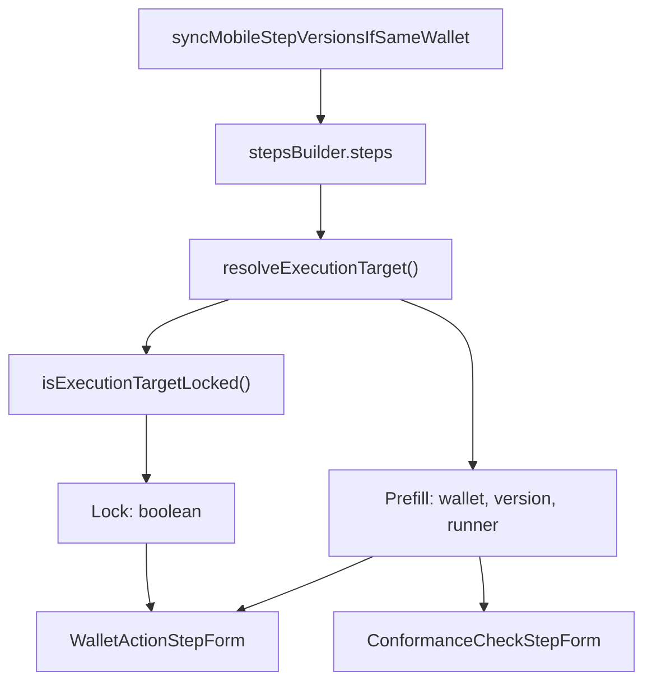

# Execution Target — Derived Prefill & Lock Design Spec

**Date:** 2026-07-09  
**Status:** Approved (design interview)  
**Scope:** Replace the mutable `ExecutionTarget` singleton with derived prefill data from pipeline steps, explicit lock rules for wallet-action forms, acyclic shared types, and preserved bulk wallet-version sync.

---

## Summary

Today `ExecutionTarget` is a module-level `$state` singleton updated imperatively (`loadFromPipeline`, `selectAction`, `syncVersionIfSameWallet`). It goes stale when steps are deleted, edited, reordered, or undone — and couples wallet-action and conformance-check forms to a global.

**Change:**

1. **Prefill** — `wallet`, `version`, `runner` derived from the **latest** `mobile-automation` step (`resolveExecutionTarget`).
2. **Lock** — separate boolean (`isExecutionTargetLocked`) controlling whether wallet / version / runner are editable in the current form session.
3. **Wiring** — `StepsBuilder` passes `getExecutionTarget` and `isExecutionTargetLocked` via `initForm`; step forms never import `execution-target/`.
4. **Bulk version** — `syncMobileStepVersionsIfSameWallet` updates all matching mobile steps in one shot (renamed from `syncVersionIfSameWallet`).
5. **Types** — shared leaf types in `pipeline-form/shared/` keep the import graph acyclic (convention only; no CI enforcement).

**Out of scope:** Conformance-check lock behavior (uses prefill only); new i18n keys; dependency-cruiser rules.

---

## Problem

| Scenario | Current behavior | Desired behavior |
|----------|------------------|------------------|
| Delete last mobile-automation step | Stale wallet in singleton | Prefill `undefined` automatically |
| Edit / reorder / undo steps | Singleton not updated | Prefill tracks latest step |
| Add 2nd step, 1st has global runner | Partial global-runner discard hack | Locked: summary + action picker only |
| Add 2nd step, 1st has specific runner | Same as above | Unlocked: prefilled defaults, full funnel |
| Edit sole step with global runner | Discard hidden via `hasGlobalRunner()` | **Unlocked** — full edit |
| Bulk change wallet version | Updates steps + singleton patch | Updates steps; prefill derived from steps |

---

## Two concepts

### Prefill (`ExecutionTargetConfig`)

- **Fields:** `wallet`, `version`, `runner` (not `action`).
- **Source:** last `mobile-automation` step with valid enriched data in committed `steps`.
- **Alias:** `ExecutionTargetConfig = MobileTargetFields` (shared type).

### Lock (`isExecutionTargetLocked`)

Independent of prefill. When locked:

- Wallet, version, runner are read-only (summary, no discard, no pickers).
- **Only action** is editable in the wallet step form.
- Cross-step version changes use bulk **Change wallet version** in the steps list.

When unlocked: full funnel (wallet → version → runner → action).

---

## Lock rule

```ts
function isExecutionTargetLocked(ctx: {
  intent: FormIntent;
  mobileStepCount: number;
  target: ExecutionTargetConfig | undefined;
}): boolean {
  if (ctx.intent === 'edit' && ctx.mobileStepCount === 1) {
    return false;
  }
  if (!ctx.target) return false;
  return target.runner === GLOBAL_RUNNER || target.runner === undefined;
}
```

| Scenario | Locked? |
|----------|---------|
| Add 1st mobile step | No |
| Add 2nd, 1st has global / undefined runner | **Yes** |
| Add 2nd, 1st has specific runner | No |
| Edit sole step (any runner) | **No** |
| Edit step A when 2+ exist, latest has global / undefined runner | Yes |
| Edit step A when 2+ exist, latest has specific runner | No |

Lock decision uses the **latest** step's runner (execution target), including when editing an earlier step.

---

## UX: locked on add

When **locked** on add intent:

1. Prefill `data` from `getExecutionTarget()`.
2. Open directly on **`select-action`** with wallet / version / runner summary above (no discard).
3. `selectAction` → `commitIfAdding`.

---

## Architecture



### `initForm` contract

```ts
type ExecutionTargetFormContext = {
  getExecutionTarget: () => MobileTargetFields | undefined;
  isExecutionTargetLocked: () => boolean;
};

type InitFormOptions<T> = {
  intent?: FormIntent;
  initial?: T;
} & Partial<ExecutionTargetFormContext>;
```

`StepsBuilder.openForm` passes both getters. `mobileStepCount` for lock:

- **add:** committed mobile-automation steps before the new one is pushed.
- **edit:** total mobile-automation steps including the step being edited.

---

## Type layering (acyclic)

```
Layer 0  $lib/hub, $lib/pipeline/runner, @/pocketbase/types, pipeline/types
Layer 1  pipeline-form/shared/  (mobile-target.ts, enriched-step.ts, guards.ts)
Layer 2  execution-target/      (types, resolve, lock, sync-mobile-versions)
Layer 3  steps/form-context.ts  (imports shared only — not execution-target/)
Layer 4  steps/types.ts, wallet-action/types.ts
Layer 5  step form classes + .svelte
Layer 6  steps-builder.svelte.ts
Layer 7  pipeline-form.svelte.ts
```

**Rules:**

- `wallet-action/` and `execution-target/` are siblings; neither imports the other.
- `form-context.ts` imports `MobileTargetFields` from `shared/`, not `execution-target/`.
- `resolve.ts` uses `isMobileTargetFields` guard, not `WalletActionStepData`.
- `EnrichedStep` lives in `shared/enriched-step.ts`; `steps-builder/types.ts` re-exports.

---

## Bulk wallet version sync

Renamed from `syncVersionIfSameWallet`:

```ts
function syncMobileStepVersionsIfSameWallet(
  steps: EnrichedStep[],
  walletId: string,
  version: SelectedVersion
): EnrichedStep[]
```

Updates every `mobile-automation` step whose wallet matches `walletId`, re-serializing `with` via `walletActionStepConfig.serialize`. Called from `StepsBuilder.applyBulkWalletVersion` after `getBulkWalletVersionContext` validates the bulk condition.

No mutable execution-target store — prefill picks up the new version via `resolveExecutionTarget`.

---

## Files

| Action | Path |
|--------|------|
| Create | `webapp/src/lib/pipeline-form/shared/mobile-target.ts` |
| Create | `webapp/src/lib/pipeline-form/shared/enriched-step.ts` |
| Create | `webapp/src/lib/pipeline-form/shared/guards.ts` |
| Create | `webapp/src/lib/pipeline-form/execution-target/types.ts` |
| Create | `webapp/src/lib/pipeline-form/execution-target/resolve.ts` |
| Create | `webapp/src/lib/pipeline-form/execution-target/lock.ts` |
| Create | `webapp/src/lib/pipeline-form/execution-target/sync-mobile-versions.ts` |
| Create | `webapp/src/lib/pipeline-form/steps/form-context.ts` |
| Create | `webapp/src/lib/pipeline-form/steps/wallet-action/types.ts` |
| Delete | `webapp/src/lib/pipeline-form/execution-target/state.svelte.ts` |
| Modify | `webapp/src/lib/pipeline-form/execution-target/index.ts` |
| Modify | `webapp/src/lib/pipeline-form/steps/types.ts` |
| Modify | `webapp/src/lib/pipeline-form/steps/wallet-action/wallet-action-step-form.svelte.ts` |
| Modify | `webapp/src/lib/pipeline-form/steps/wallet-action/wallet-action-step-form.svelte` |
| Modify | `webapp/src/lib/pipeline-form/steps/conformance-check/conformance-check-step-form.svelte.ts` |
| Modify | `webapp/src/lib/pipeline-form/steps-builder/steps-builder.svelte.ts` |
| Modify | `webapp/src/lib/pipeline-form/steps-builder/types.ts` |
| Modify | `webapp/src/lib/pipeline-form/pipeline-form.svelte.ts` |
| Modify | `webapp/src/lib/pipeline-form/pipeline-form.test.ts` |
| Test | `execution-target/*.test.ts`, wallet-action form tests |

---

## Removed

- `ExecutionTarget.state` singleton
- `loadFromPipeline` / `clear` in `PipelineForm`
- `selectAction` write to singleton
- `hasGlobalRunner()` / `hasUndefinedRunner()` / `shouldDefaultToGlobalRunner()` as global module exports
- Direct `execution-target` imports in step forms and `.svelte` templates

---

## Testing

| Module | Cases |
|--------|-------|
| `resolve.ts` | no steps; error-enriched step; one step; two steps → last wins |
| `lock.ts` | edit sole + global → false; add 2nd + global → true; add 2nd + specific → false; edit 2+ + global latest → true |
| `sync-mobile-versions.ts` | updates all matching steps; skips other wallets; re-serializes `with` |
| `WalletActionStepForm` | locked add starts at select-action; unlocked add full funnel; edit sole global unlocked |

Manual smoke:

1. Pipeline with one mobile step (global runner) → edit → can change wallet/version/runner.
2. Add second mobile step (global on first) → locked, action-only funnel.
3. Bulk change wallet version on two shared-wallet steps → all versions update; conformance check sees new target.

---

## Implementation

See `docs/superpowers/plans/2026-07-09-execution-target-derived-prefill.md`.
