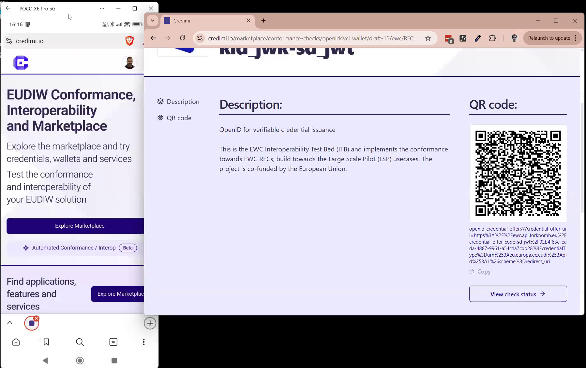

StepCI is the integration layer used by Credimi to call external Issuers and Verifiers.

Its role on Credimi is broader than generic API testing:

- it powers QR codes and deeplinks shown on the Marketplace
- it lets users manually try issuance and verification flows
- it provides the service-side step reused later in automation pipelines

## Add a credential integration

From the issuer and credential editor, add a StepCI recipe for the credential you want to expose.


A successful recipe typically captures a deeplink such as:

```text
haip-vci://...
```

or:

```text
openid-credential-offer://...
```

## Add a verifier integration

Verification flows are integrated in the same way, but the output is usually a presentation request instead of a credential offer.

## Preview before publishing

Credimi lets you preview the generated QR code and deeplink before publishing the integration.



## Reuse later in automation

The exact same StepCI asset can later be used inside a pipeline, where the generated deeplink is passed to Maestro instead of being scanned manually.
