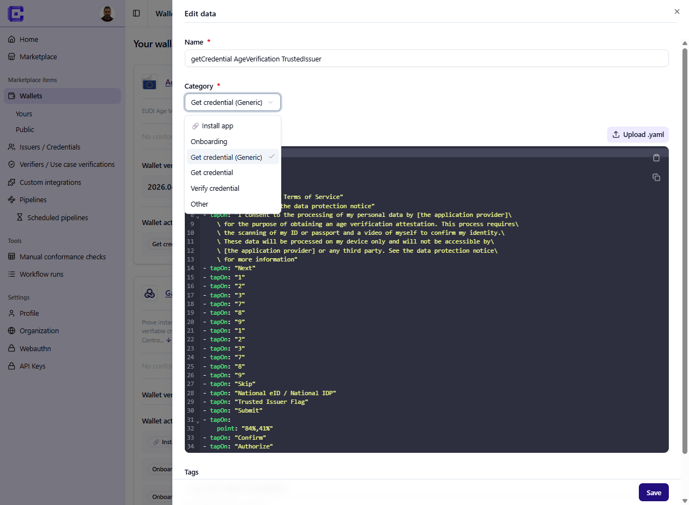
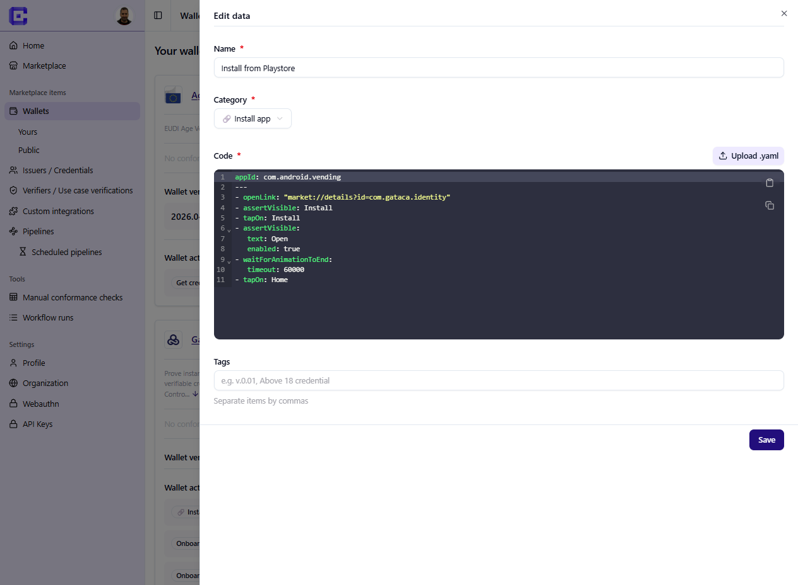

Maestro is the UI automation layer used by Credimi for Wallet-side behavior.

## IMPORTAN: read this first! 

1. We use [Maestro documentation](https://docs.maestro.dev/reference/commands-available) for mobile automation, working on Android and iOS. 

1. In order to create your own scripts you probably want to use [Maestro Studio](https://maestro.dev/#maestro-studio), which connects to an Android Device (or Emulator) and an iOS Simulator, and install [Maestro CLI](https://docs.maestro.dev/maestro-cli)

1. We refer to automation scripts in Maestro as *Maestro actions*. Scripts are in YAML, they can be executed in Maestro Studio, Maestro CLI and in **Credimi pipelines**.

1. Credimi pipelines can be executed in a [Credimi-runner](https://github.com/ForkbombEu/credimi-runner) instance: we offer some machine/emulators hosted by us, you can host your own or use 3rd party services such as Maestro Cloud (ask as if you want to know more).

:::tip
- Browse Maestro and StepCI [scripting recipes](../manual/publish-to-marketplace/yaml-examples/)
- All the Maestro and StepCI scripts are in the [Marketplace](https://credimi.io/marketplace), under Wallets / Credentials / Use Case Verifications
- See [Maestro documentation](https://docs.maestro.dev/reference/commands-available)
:::

### Intro to Maestro 
A Maestro action typically contains steps such as:

- open the app
- complete onboarding
- enter a PIN
- open a deeplink
- navigate to a screen
- accept or present a credential

## Action categories

Actions can be re-used across pipelines and chained in the same pipeline, they include:

- **🔗 install app** 
- onboarding 
- Get credential 
- Verify credential 
- Other (utility actions for navigation or reset)

:::caution
The **🔗 install app** action has a special semantic, it means the appp will be installed from an external source (PlayStor/AppStore/AppTester/TestFligh). 
:::

### App installation: PlayStore/AppStore

Using an action tagged as **🔗 install app** has impacts on the pipeline orchestration: Temporal (the orchestrator) will count all the apps installed before the execution, in order to be able to unistall the app that was installed here. 

See what an **🔗 install app** action looks like: 

### App installation: upload Android / iOS Installer  

You can also upload your .apk / iOS installer, to do this: 
- Go to https://credimi.io/my/wallets 
- Click on **Add new version** 
- Type some useful metadata in "tag" and upload your Android/iOS installer (current limit is 500MB, let us know if you need more)

### App installation via CI/CD 

You may as well connect Credimi pipeline execution to your CI/CD, and trigger the upload of the installer. Documentation is coming soon (ask us). 

## Script now, re-use (and let re-use) later

In Credimi, pipelines are composed from assets that already exist, you usually create:

1. StepCI integrations
2. Maestro actions
3. the pipeline that combines them

At the same time, you can re-use StepCI and Maestro Actions written by others (and they can use yours).

:::tip
- Browse Maestro and StepCI [scripting recipes](../manual/publish-to-marketplace/yaml-examples/)
- All the Maestro and StepCI scripts are in the [Marketplace](https://credimi.io/marketplace), under Wallets / Credentials / Use Case Verifications
- See [Maestro documentation](https://docs.maestro.dev/reference/commands-available)
:::

